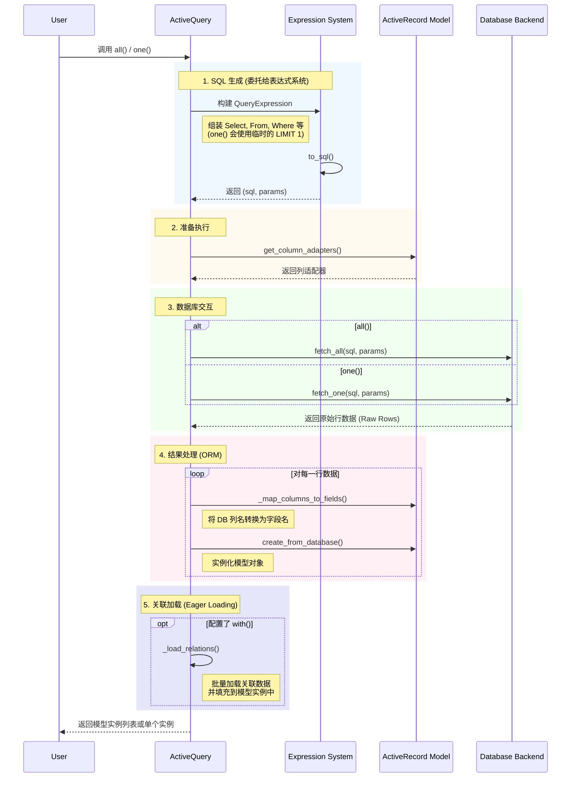
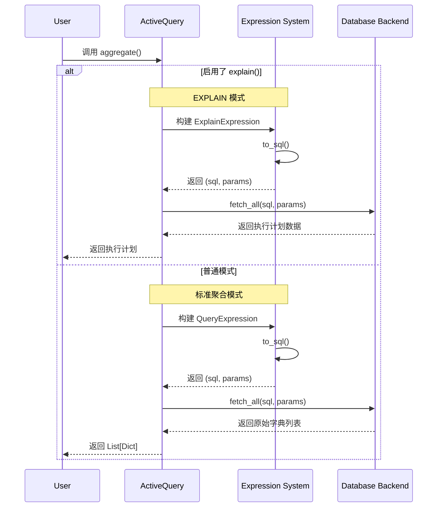
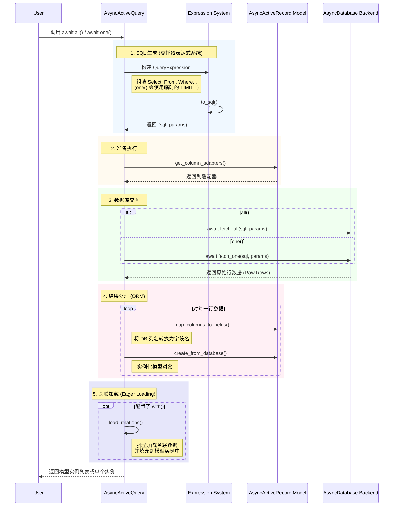

# ActiveQuery (模型查询)

`ActiveQuery` 是 `rhosocial-activerecord` 中最常用的查询对象，专为查询和操作 `ActiveRecord` 模型而设计。它通过混入（Mixin）多个功能模块，提供了丰富的查询能力。

默认情况下，`ActiveQuery` 的查询结果是模型实例（Model Instances）。

本章还将介绍**同步异步对等**原则，其中 `ActiveQuery` 有一个直接的异步对应物 `AsyncActiveQuery`，具有等效的功能和一致的 API。

## 简洁且可预测的设计

我们的查询系统强调简洁性和可预测性：

- **简单的加载策略**: 只有必要的和清晰的加载策略，避免策略爆炸问题
- **无复杂事件系统**: 与具有数十种事件类型的系统不同，我们只提供基本的生命周期钩子
- **显式控制**: 用户完全控制何时以及如何执行查询
- **无隐藏行为**: 没有用户无法控制的自动刷新或隐藏的数据库操作

## BaseQueryMixin (基础构建块)

提供了构建 SQL 查询的基础方法。

### `select(*columns)`

指定要查询的列。如果不指定，默认查询所有列（`SELECT *`）。

*   **用法示例**：

```python
# 查询所有列
users = User.query().all()

# 仅查询特定列
users = User.query().select(User.c.id, User.c.name).all()

# 使用别名 (as_)
users = User.query().select(User.c.name.as_("username"), User.c.email).all()
```

*   **注意事项**：
    *   如果只选择了部分列，返回的模型实例中未被选择的字段将为默认值或 `None`（取决于模型定义）。
    *   在严格模式下，如果后续逻辑依赖于未被选中的字段，可能会导致错误。

### `where(condition)`

添加过滤条件（AND 逻辑）。支持多次调用，每次调用会将条件以 AND 逻辑组合。

* **用法示例**：

```python
# 简单条件
User.query().where(User.c.id == 1)

# 多次调用 (AND 逻辑)
# 注意：这与下方的单次 .where(&) 调用是等价的
User.query().where(User.c.age >= 18).where(User.c.is_active == True)
# 等价于：
User.query().where((User.c.age >= 18) & (User.c.is_active == True))

# 组合条件 (OR) - 注意：需要使用 | 运算符
User.query().where((User.c.role == 'admin') | (User.c.role == 'moderator'))

# 使用原始 SQL 字符串 (注意：需防范 SQL 注入)
# 注意：占位符必须使用 '?' 符号，不支持其他占位符格式
User.query().where('status = ?', ('active',))
```

* **注意事项**：
* **参数类型**：`.where()` 只接受 `SQLPredicate` 表达式或 SQL 字符串，**不支持字典参数**。
* **优先级问题**：在使用 `&` (AND) 和 `|` (OR) 时，**务必使用括号**包裹每个子条件，因为 Python 中位运算符的优先级较高。
* **占位符格式**：使用原始 SQL 字符串时，占位符**必须**使用 `?` 符号。其他格式（如 `%s`、`:1` 等）不被支持。

### `order_by(*columns)`

指定排序规则。

* **用法示例**：

```python
# 单列升序
User.query().order_by(User.c.created_at)

# 多列排序 (先按 role 升序，再按 age 降序)
User.query().order_by(User.c.role, (User.c.age, "DESC"))
```

* **注意事项**：
* **排序方向**：排序方向字符串只能是 `"ASC"`（升序）或 `"DESC"`（降序）。如果省略方向，默认为升序。**不支持其他字符串值**，传入其他值将直接传递给数据库，可能导致错误。

### `limit(limit, offset=None)` / `offset(offset)`

分页查询。

* **用法示例**：

```python
# 获取前 10 条
User.query().limit(10)

# 跳过前 20 条，取 10 条 (即第 3 页)
User.query().limit(10, offset=20)
# 或者（推荐写法）
User.query().limit(10).offset(20)
```

* **注意事项**：
* **参数约束**：`limit` **必须是正整数**（大于 0），`offset` **必须是非负整数**（大于等于 0）。传入其他值（如负数、浮点数、字符串等）可能导致不可预测的行为或数据库错误。
* **SQLite 后端限制**：在 SQLite 后端中，`OFFSET` 必须与 `LIMIT` 一起使用。
```python
# 错误：SQLite 不支持仅有 OFFSET 的查询
User.query().offset(20) # 会抛出 ValueError

# 正确写法
User.query().limit(10).offset(20) # 推荐
User.query().limit(10, offset=20) # 或使用参数形式
```

* **注意事项**：
  * **SQLite 后端限制**：在 SQLite 后端中，`OFFSET` 必须与 `LIMIT` 一起使用。请确保先调用 `.limit()` 或使用 `.limit(limit, offset=offset)` 参数形式。
  ```python
  # 错误：SQLite 不支持仅有 OFFSET 的查询
  User.query().offset(20)  # 会抛出 ValueError

  # 正确写法
  User.query().limit(10).offset(20)  # 推荐
  User.query().limit(10, offset=20)  # 或使用参数形式
  ```

### `for_update(nowait=False, skip_locked=False)`

行级悲观锁，用于并发事务场景。在事务中对选中的行加锁，防止其他事务修改。

* **用法示例**：

```python
# 在事务中锁定行
with User.transaction():
    user = User.query().where(User.c.id == 1).for_update().one()
    user.balance -= 100
    user.save()
```

* **参数说明**：
  * `nowait=True`：如果行被锁定，立即抛出错误而非等待。
  * `skip_locked=True`：跳过已锁定的行（适用于任务队列场景）。

* **后端支持情况**：

| 后端 | 支持 | 说明 |
|------|------|------|
| MySQL | ✅ | 支持所有参数 |
| PostgreSQL | ✅ | 支持所有参数 |
| SQLite | ❌ | 不支持，使用文件级锁 |

> **注意**：上表仅供参考，具体后端的能力可能因版本或配置而变化。请使用 `supports_for_update()` 方法动态检测后端能力。

* **能力检测**：

在使用 `for_update()` 前，建议先检测后端是否支持：

```python
dialect = User.backend().dialect
if dialect.supports_for_update():
    user = User.query().where(User.c.id == 1).for_update().one()
else:
    # SQLite 等不支持的后端，使用替代方案
    user = User.find_one(1)
```

如果不检测直接在不支持的后端上调用 `for_update()`，会抛出 `UnsupportedFeatureError`。

* **注意事项**：
  - **必须在事务中使用**：`FOR UPDATE` 在事务外无意义。
  - **避免死锁**：多个事务以不同顺序锁定资源可能导致死锁。
  - **跨数据库兼容**：编写跨数据库代码时，务必使用 `supports_for_update()` 检测。

详细的并发控制策略，请参阅 [并发控制](../performance/concurrency.md)。

### `group_by(*columns)` / `having(condition)`

分组统计。

*   **用法示例**：

```python
# 统计每个角色的用户数量
# SELECT role, COUNT(*) FROM users GROUP BY role HAVING COUNT(*) > 5
User.query() \
    .select(User.c.role, func.count().as_("count")) \
    .group_by(User.c.role) \
    .having(func.count() > 5) \
    .aggregate()
```

### 去重查询

目前 `ActiveQuery` 没有独立的 `.distinct()` 方法。如需去重查询，可以使用以下替代方案：

*   **使用聚合函数的 `is_distinct` 参数**：

```python
# 统计不重复的邮箱数量
unique_emails = User.query().count(User.c.email, is_distinct=True)

# 计算不重复的总分
unique_total = Order.query().sum_(Order.c.amount, is_distinct=True)

# 计算不重复的平均分
unique_avg = Student.query().avg(Student.c.score, is_distinct=True)
```

### `explain()`

获取查询执行计划，用于性能分析。**注意：`.explain()` 需要与 `.aggregate()` 方法配合使用才能获取执行计划。**

```python
# 获取查询执行计划 (需要使用 aggregate())
plan = User.query().where(User.c.id == 1).explain().aggregate()
print(plan)

# 可选：带参数的 EXPLAIN
plan = User.query()\
    .where(User.c.status == 'active')\
    .explain(analyze=True, format='TEXT')\
    .aggregate()
```

### 窗口函数支持

`select` 方法支持窗口函数（Window Functions）。

```python
from rhosocial.activerecord.backend.expression import rank, WindowSpecification, OrderByClause

# 对每个类别的文章按浏览量排名
# 创建窗口规范
window_spec = WindowSpecification(
    Post.backend().dialect,
    partition_by=[Post.c.category_id],
    order_by=OrderByClause(Post.backend().dialect, [(Post.c.views, "DESC")])
)

# 创建窗口函数调用
rank_col = rank(Post.backend().dialect).as_('rank')
rank_col.window_spec = window_spec

results = Post.query().select(Post.c.title, rank_col).aggregate()
```

* **注意事项**：
* 窗口函数需要从 `rhosocial.activerecord.backend.expression` 导入，而不是旧的 `window` 子模块。
* `rank`、`row_number`、`dense_rank` 等函数返回 `WindowFunctionCall` 对象。
* 窗口规范通过 `WindowSpecification` 类创建，需要传入 `dialect`、`partition_by` 和 `order_by` 参数。
* 设置窗口规范的方法是直接赋值：`rank_col.window_spec = window_spec`。

## JoinQueryMixin (连接查询)

提供了多表连接查询的能力。

*   `join(target, on=None, alias=None)`: 内连接 (INNER JOIN)。
*   `left_join(target, on=None, alias=None)`: 左外连接 (LEFT JOIN)。
*   `right_join(target, on=None, alias=None)`: 右外连接 (RIGHT JOIN)。
*   `full_join(target, on=None, alias=None)`: 全外连接 (FULL JOIN)。
*   `cross_join(target, alias=None)`: 交叉连接 (CROSS JOIN)。

*   **用法示例**：

```python
# 内连接：查找发表过文章的用户
User.query().join(Post, on=(User.c.id == Post.c.user_id))

# 左连接：查找所有用户及其文章（如果有）
User.query().left_join(Post, on=(User.c.id == Post.c.user_id))

# 带别名的连接 (自连接)
# 查找员工及其经理
Manager = User.c.with_table_alias("manager")
User.query().join(User, on=(User.c.manager_id == Manager.id), alias="manager")
```

*   **注意事项**：
    *   在连接查询中引用列时，建议明确指定表名（如 `User.c.id`），以避免歧义。
    *   使用别名时，确保 `on` 条件中引用的是别名对象的列。

## AggregateQueryMixin (聚合查询)

提供了数据统计和聚合能力。

### 简单聚合
直接返回标量值。

* `count(column=None)`: 统计行数。
* `sum_(column)`: 计算总和（注意下划线，避免与 Python 内置 `sum` 冲突）。
* `avg(column)`: 计算平均值。
* `min_(column)`: 查找最小值（注意下划线，避免与 Python 内置 `min` 冲突）。
* `max_(column)`: 查找最大值（注意下划线，避免与 Python 内置 `max` 冲突）。

### 复杂聚合
* `aggregate()`: 执行复杂的聚合查询，返回字典列表。**注意：`aggregate()` 方法不接受任何参数**。

* **用法示例**：

```python
from rhosocial.activerecord.backend.expression import sum_, avg

# 简单统计
total_users = User.query().count()
max_age = User.query().max_(User.c.age)

# 复杂聚合：同时计算总分和平均分
# 正确用法：通过 select() 选择聚合表达式，然后调用 aggregate()
stats = User.query() \
    .select(
        sum_(User.c.score).as_("total_score"),
        avg(User.c.score).as_("avg_score")
    ) \
    .aggregate()
# 返回: [{'total_score': 1000, 'avg_score': 85.5}]

# 错误用法（不支持）：
# stats = User.query().aggregate(total_score=sum_(...), avg_score=avg(...))  # ❌ aggregate() 不接受参数
```

* **注意事项**：
* `aggregate()` 方法不接受 `**kwargs` 参数。如需指定多个聚合表达式，请使用 `.select()` 方法选择聚合表达式，然后调用 `.aggregate()`。
* 返回值为字典列表，即使只有一行结果也是列表形式。

## RangeQueryMixin (范围与便捷过滤)

提供了常用的便捷过滤方法，这些方法在内部会被转换为 `where` 条件。

* `in_list(column, values)`: `IN` 查询。
* `not_in(column, values)`: `NOT IN` 查询。
* `between(column, start, end)`: `BETWEEN` 查询。
* `not_between(column, start, end)`: `NOT BETWEEN` 查询。
* `like(column, pattern)` / `not_like(...)`: 大小写敏感的模式匹配。
* `ilike(column, pattern)` / `not_ilike(...)`: 大小写不敏感的模式匹配。
* `is_null(column)` / `is_not_null(column)`: NULL 检查。

* **用法示例**：

```python
# ID 在列表中
User.query().in_list(User.c.id, [1, 2, 3])

# 名字以 "A" 开头
User.query().like(User.c.name, "A%")

# 年龄在 20 到 30 之间
User.query().between(User.c.age, 20, 30)

# 检查字段是否为 NULL
User.query().is_null(User.c.deleted_at)      # WHERE deleted_at IS NULL
User.query().is_not_null(User.c.email)       # WHERE email IS NOT NULL
```

* **注意事项**：
* `like` 和 `ilike` 需要自行在 pattern 中包含通配符 `%` 或 `_`。
* `in_list` 如果传入空列表，可能会生成 `FALSE` 条件（取决于数据库方言）。

### NULL 值比较的正确方式

在 SQL 中检查字段是否为 NULL 时，**必须使用 `IS NULL` 或 `IS NOT NULL`**，而不能使用 `=` 或 `!=` 运算符。在 Python 中，正确的做法如下：

```python
# ✅ 正确：使用 is_null() / is_not_null() 方法
User.query().is_null(User.c.deleted_at)
User.query().is_not_null(User.c.email)

# ✅ 正确：使用 is_() / is_not() 方法（与上面等价）
User.query().where(User.c.deleted_at.is_(None))
User.query().where(User.c.email.is_not(None))

# ❌ 错误：不能使用 == None 或 != None
# User.query().where(User.c.deleted_at == None)  # 这不符合 Python 语法规范（PEP 8）
# User.query().where(User.c.email != None)       # 同样不推荐

# ❌ 错误：不能使用 is None 或 is not None
# User.query().where(User.c.deleted_at is None)  # 'is' 运算符不能被重载，这会直接比较对象身份
# User.query().where(User.c.email is not None)   # 同样无效
```

**原因说明**：
1. `== None` 和 `!= None` 违反了 Python 的 PEP 8 规范，该规范建议使用 `is None` 或 `is not None` 来比较 `None`。
2. `is` 和 `is not` 运算符在 Python 中不能被重载，因此无法用于构建 SQL 表达式。它们只能比较 Python 对象的身份（identity）。
3. `is_()` 和 `is_not()` 方法是 ORM 框架提供的专门用于生成 `IS NULL` 和 `IS NOT NULL` SQL 子句的方法。

## RelationalQueryMixin (关联加载)

提供了关联关系预加载能力，用于解决 N+1 查询问题。
关于缓存机制和 N+1 问题的详细解释，请参阅 [缓存机制](../performance/caching.md)。

*   `with_(*relations)`: 预加载关联关系。

`with_()` 方法支持三种主要用法：

### 1. 简单预加载 (Simple Eager Loading)

使用关联名称字符串，加载直接关联的模型。

```python
# 预加载用户的文章
users = User.query().with_("posts").all()

# 同时加载多个关联
users = User.query().with_("posts", "profile").all()
```

### 2. 嵌套预加载 (Nested Eager Loading)

使用点号 (`.`) 分隔的路径字符串，加载深层关联。使用路径语法时，每一层关系都会被自动加载。

```python
# 加载用户的文章，以及每篇文章的评论
users = User.query().with_("posts.comments").all()

# 加载更深层级：用户的文章 -> 评论 -> 作者
users = User.query().with_("posts.comments.author").all()
```

**等价写法**：路径语法会展开为每一层级的完整路径列表，框架会自动按正确顺序加载。

```python
# 路径语法
users = User.query().with_("posts.comments").all()

# 等价写法：每一级都需要列出（按加载顺序）
users = User.query().with_("posts", "posts.comments").all()
# 框架会按顺序加载：先加载 posts，再加载 posts.comments
```

**同时加载多个独立路径**：可以同时加载多个不相关的嵌套路径，框架会自动排序并批量加载。相同关系无需重复列出，框架会自动去重。

```python
# 同时加载用户的文章和用户的个人资料
users = User.query().with_("posts", "profile").all()

# 同时加载两个独立的嵌套路径
# posts.comments 和 posts.tags 是两个独立的嵌套链
users = User.query().with_("posts.comments", "posts.tags").all()

# 等价写法（每一级都需要列出，框架会自动去重）
users = User.query().with_("posts", "posts.comments", "posts.tags").all()
# 注意：posts 只需要列出一次，框架会自动应用到所有依赖它的路径
```

### 3. 带查询修改器的预加载 (Eager Loading with Modifiers)

使用元组 `(relation_name, modifier_func)` 对关联查询进行自定义（如过滤、排序）。

*   `modifier_func` 是一个接收 **原始查询对象** 的函数，参数类型为 `ActiveQuery`（或异步版本的 `AsyncActiveQuery`）。
*   用户只需在该查询对象上**附加具体条件**即可，**无需调用终端方法**（如 `.all()`、`.one()` 等）。
*   函数返回值必须是 `ActiveQuery` 或 `AsyncActiveQuery` 实例。
*   **注意**：同一关联关系不要重复出现，后出现的会覆盖先出现的，导致先出现的失效。

```python
# 预加载用户的文章，但只加载状态为 'published' 的文章
# lambda 参数 q 是 ActiveQuery 实例，只需附加 .where() 条件
users = User.query().with_(
    ("posts", lambda q: q.where(Post.c.status == 'published'))
).all()

# 预加载文章的评论，并按创建时间倒序排列
# 只需附加 .order_by() 排序条件，返回修改后的查询对象
posts = Post.query().with_(
    ("comments", lambda q: q.order_by((Comment.c.created_at, "DESC")))
).all()

# 混合使用：嵌套加载 + 修改器
users = User.query().with_(
    "posts",
    ("posts.comments", lambda q: q.where(Comment.c.is_deleted == False))
).all()

# 错误示例：同一关联重复出现，后面的会覆盖前面的
# posts 被定义了两次，第二个会覆盖第一个，导致第一个条件失效
users = User.query().with_(
    ("posts", lambda q: q.where(Post.c.status == 'published')),
    ("posts", lambda q: q.order_by(Post.c.created_at))  # 这会覆盖上面的条件
).all()
```

*   **注意事项**：
    *   关联名称必须与模型中定义的 `HasOne`、`HasMany`、`BelongsTo` 字段名一致。
    *   修改器函数必须返回查询对象。

### 4. 高级：参数展开与优先级规则

`with_()` 方法在处理多个带修改器的参数时有特定的规则。了解这些规则有助于避免常见问题。

#### 参数展开规则

每个参数都会展开为其完整的路径链。查询修改器仅适用于**目标关联**（路径中的最后一个），不适用于中间关联：

```python
# 参数 'posts.comments' 展开为：
# - 'posts' -> None（中间关联，无修改器）
# - 'posts.comments' -> modifier1（目标关联，有修改器）

User.query().with_(
    ('posts.comments', lambda q: q.where(Comment.c.is_deleted == False))
)
# 结果：posts 无修改器，posts.comments 有修改器
```

#### 后参数优先原则

当后面的参数覆盖前面的参数时，较新的参数始终获胜。这遵循 Yii2 行为：

```python
# 当后面的参数覆盖前面的参数时：
('posts.comments', m1) + ('posts.comments.user', m2) 结果为：
- 'posts' -> None（来自第二个，覆盖！）
- 'posts.comments' -> m2（来自第二个，覆盖 m1！）
- 'posts.comments.user' -> m2
```

**因此，如果不想让修改器被覆盖，请将其放在参数列表的后面：**

```python
# 正确顺序：m1 会被使用
User.query().with_(
    ('posts.comments.user', m2),  # 后面 - 先应用
    ('posts.comments', m1),        # 前面 - 后应用（获胜）
)

# 错误顺序：m2 会覆盖 m1
User.query().with_(
    ('posts.comments', m1),        # 前面 - 会被覆盖
    ('posts.comments.user', m2),  # 后面 - 获胜
)
```

#### 命名函数 vs 匿名函数（Lambda）

对于复杂的修改器，建议使用**命名函数**而非匿名函数。命名函数提供更好的调试体验：

```python
# 推荐：命名函数（在警告中显示完整名称）
def filter_published(q):
    return q.where(Post.c.status == 'published')

User.query().with_(('posts', filter_published))

# 复杂情况避免使用：lambda（在警告中只显示 <lambda>）
User.query().with_(('posts', lambda q: q.where(...)))
```

当修改器被覆盖时，系统会记录警告并显示函数名称。命名函数会显示其完整限定名称（例如 `module.filter_published`），而匿名函数只显示 `<lambda>`，使调试更加困难。

#### 验证与错误处理

`with_()` 方法会对关联路径进行完整验证：

- **无效关联路径**：对于空字符串、开头/结尾的点号或连续的点号，抛出 `InvalidRelationPathError`
- **关联不存在**：如果路径中任何关联在对应模型上不存在，抛出 `RelationNotFoundError`

```python
# 以下会抛出错误：
User.query().with_('')  # InvalidRelationPathError: 关联路径不能为空
User.query().with_('.posts')  # InvalidRelationPathError: 不能以点号开头
User.query().with_('invalid_relation')  # RelationNotFoundError
```

## 集合操作发起

`ActiveQuery` 实例可以作为集合操作的左操作数，与另一个 `ActiveQuery`、`CTEQuery` 或 `SetOperationQuery` 实例进行集合运算。除了使用方法调用外，还支持使用 Python 运算符重载来发起集合操作。

*   `union(other)` 或 `+`: 发起 UNION 操作。
*   `intersect(other)` 或 `&`: 发起 INTERSECT 操作。
*   `except_(other)` 或 `-`: 发起 EXCEPT 操作。

返回的对象是一个 `SetOperationQuery` 实例，可以继续链式调用（如 `order_by`, `limit` 等）或执行（`to_sql`）。

**注意**：
*   **无 one/all 方法**：`SetOperationQuery` 没有 `.one()` 和 `.all()` 方法，这两个方法是 `ActiveQuery` / `AsyncActiveQuery` 专有的。
*   **同步异步对等**：集合运算遵循同步异步对等原则，**不能混用**。同步 `ActiveQuery` 只能与同步查询进行集合运算，异步同理。

*   **用法示例**：

```python
q1 = User.query().where(User.c.age > 20)
q2 = User.query().where(User.c.age < 30)

# 使用方法调用
union_q = q1.union(q2)

# 使用运算符重载
intersect_q = q1 & q2  # INTERSECT
except_q = q1 - q2     # EXCEPT
union_q_op = q1 + q2   # UNION

# 查看 SQL
sql, params = intersect_q.to_sql()
print(sql)
# SELECT * FROM users WHERE age > ? INTERSECT SELECT * FROM users WHERE age < ?

# SetOperationQuery 没有 .one() 和 .all() 方法，只能使用 .to_sql() 查看 SQL
# 如需获取结果，需要转换为列表或其他方式
```

## 预定义查询范围 (Scopes)

为了提高代码的可重用性和可读性，建议在 Model 类中定义类方法来封装常用的查询条件。这类似于其他框架中的 Scope 概念。

由于 `Model.query()` 返回一个新的查询对象，你可以在其基础上链式调用方法，并返回配置好的查询对象。

### 示例

假设我们有一个博客系统，包含 `Post`（文章）和 `Comment`（评论）模型。我们希望经常查询“已发布且评论最多”的文章。

```python
class Post(Model):
    # ... 字段定义 ...

    @classmethod
    def query_published(cls):
        """预定义查询：仅包含已发布的文章"""
        return cls.query().where(cls.c.status == "published")

    @classmethod
    def query_with_most_comments(cls):
        """预定义查询：按评论数降序排列"""
        # 假设 Comment 表有 post_id 字段
        # 这里使用子查询或 join 来统计评论数
        return cls.query_published() \
            .select(cls.c.title, func.count(Comment.c.id).as_("comment_count")) \
            .left_join(Comment, on=(cls.c.id == Comment.c.post_id)) \
            .group_by(cls.c.id) \
            .order_by(("comment_count", "DESC"))

# 使用
# 获取已发布且评论最多的前 5 篇文章
top_posts = Post.query_with_most_comments().limit(5).all()
```

这种模式的好处是：
1.  **封装复杂逻辑**：调用者无需关心底层的 Join 和 Where 条件。
2.  **可链式调用**：返回的是 `ActiveQuery` 对象，因此可以继续调用 `limit()`, `offset()`, `all()` 等方法。
3.  **代码复用**：`query_with_most_comments` 内部复用了 `query_published`。

## 查询操作中的同步异步对等 (Sync-Async Parity in Query Operations)

**同步异步对等**原则确保 `ActiveQuery` 和 `AsyncActiveQuery` 提供具有相同 API 的等效功能。两种实现中都提供相同的查询构建方法：

```python
# 同步查询
users_sync = User.query().where(User.c.active == True).all()

# 异步查询 - 相同的 API，只需使用 await
async def get_users_async():
    users_async = await AsyncUser.query().where(AsyncUser.c.active == True).all()
    return users_async
```

## 执行方法

这些方法会触发数据库查询并返回结果。

*   `all() -> List[Model]`: 返回所有匹配的模型实例列表。
*   `one() -> Optional[Model]`: 返回第一条匹配的记录，如果没有找到则返回 None。
*   `exists() -> bool`: 检查是否存在匹配的记录。
    *   此方法由 `AggregateQueryMixin` 提供。
*   `aggregate() -> List[Dict]`: 返回原始字典列表（不映射为模型实例），常用于统计分析。
    *   与 `.all()` / `.one()` 的区别：返回字典而非模型实例，适用于不需要模型封装的数据统计场景。
    *   **与 `.explain()` 配合使用**：如需获取查询执行计划，请使用 `.explain().aggregate()`。
*   `to_sql() -> Tuple[str, List[Any]]`: 返回生成的 SQL 语句和参数（不执行查询）。

*   **调试技巧**：
    *   在执行 `all()` 或 `one()` 之前，可以调用 `to_sql()` 查看生成的 SQL，这对于排查查询错误非常有帮助。

```python
sql, params = User.query().where(User.c.id == 1).to_sql()
print(sql, params)
# SELECT * FROM users WHERE id = ? [1]
```

## 查询生命周期与执行流程

为了更好地理解 `ActiveQuery` 是如何工作的，以下展示了 `all()`、`one()` 和 `aggregate()` 方法的执行生命周期。

**重要说明**：`ActiveQuery` 本身并不负责拼接 SQL 字符串，它仅仅是调用底层**表达式系统**（Expression System）来构建查询。所有的 SQL 生成工作都委托给了表达式系统，确保了 SQL 的安全性和对不同数据库方言的兼容性。

### 1. `all()` 和 `one()` 的生命周期

这两个方法主要用于获取模型实例。流程包括构建表达式、SQL 生成、数据库执行、数据映射和模型实例化。


```mermaid
sequenceDiagram
    participant User
    participant Query as ActiveQuery
    participant Expr as Expression System
    participant Model as ActiveRecord Model
    participant Backend as Database Backend

    User->>Query: 调用 all() / one()
    
    rect rgb(240, 248, 255)
        Note over Query, Expr: 1. SQL 生成 (委托给表达式系统)
        Query->>Expr: 构建 QueryExpression
        Note right of Query: 组装 Select, From, Where 等<br/>(one() 会使用临时的 LIMIT 1)
        Expr->>Expr: to_sql()
        Expr-->>Query: 返回 (sql, params)
    end

    rect rgb(255, 250, 240)
        Note over Query: 2. 准备执行
        Query->>Model: get_column_adapters()
        Model-->>Query: 返回列适配器
    end

    rect rgb(240, 255, 240)
        Note over Query: 3. 数据库交互
        alt all()
            Query->>Backend: fetch_all(sql, params)
        else one()
            Query->>Backend: fetch_one(sql, params)
        end
        Backend-->>Query: 返回原始行数据 (Raw Rows)
    end

    rect rgb(255, 240, 245)
        Note over Query: 4. 结果处理 (ORM)
        loop 对每一行数据
            Query->>Model: _map_columns_to_fields()
            Note right of Query: 将 DB 列名转换为字段名
            Query->>Model: create_from_database()
            Note right of Query: 实例化模型对象
        end
    end

    rect rgb(230, 230, 250)
        Note over Query: 5. 关联加载 (Eager Loading)
        opt 配置了 with()
            Query->>Query: _load_relations()
            Note right of Query: 批量加载关联数据<br/>并填充到模型实例中
        end
    end

    Query-->>User: 返回模型实例列表或单个实例
```

### 2. `aggregate()` 的生命周期

`aggregate()` 方法用于返回原始字典数据，常用于统计分析或无需模型实例化的场景。它同样依赖表达式系统生成 SQL。


```mermaid
sequenceDiagram
    participant User
    participant Query as ActiveQuery
    participant Expr as Expression System
    participant Backend as Database Backend

    User->>Query: 调用 aggregate()

    alt 启用了 explain()
        Note over Query, Expr: EXPLAIN 模式
        Query->>Expr: 构建 ExplainExpression
        Expr->>Expr: to_sql()
        Expr-->>Query: 返回 (sql, params)
        Query->>Backend: fetch_all(sql, params)
        Backend-->>Query: 返回执行计划数据
        Query-->>User: 返回执行计划
    else 普通模式
        Note over Query, Expr: 标准聚合模式
        Query->>Expr: 构建 QueryExpression
        Expr->>Expr: to_sql()
        Expr-->>Query: 返回 (sql, params)
        Query->>Backend: fetch_all(sql, params)
        Backend-->>Query: 返回原始字典列表
        Query-->>User: 返回 List[Dict]
    end
```

### 3. 异步查询生命周期 (Async Query Lifecycle)

异步版本遵循相同的流程，但在数据库操作中使用 `await`：


```mermaid
sequenceDiagram
    participant User
    participant Query as AsyncActiveQuery
    participant Expr as Expression System
    participant Model as AsyncActiveRecord Model
    participant Backend as AsyncDatabase Backend

    User->>Query: 调用 await all() / await one()

    rect rgb(240, 248, 255)
        Note over Query, Expr: 1. SQL 生成 (委托给表达式系统)
        Query->>Expr: 构建 QueryExpression
        Note right of Query: 组装 Select, From, Where...<br/>(one() 会使用临时的 LIMIT 1)
        Expr->>Expr: to_sql()
        Expr-->>Query: 返回 (sql, params)
    end

    rect rgb(255, 250, 240)
        Note over Query: 2. 准备执行
        Query->>Model: get_column_adapters()
        Model-->>Query: 返回列适配器
    end

    rect rgb(240, 255, 240)
        Note over Query: 3. 数据库交互
        alt all()
            Query->>Backend: await fetch_all(sql, params)
        else one()
            Query->>Backend: await fetch_one(sql, params)
        end
        Backend-->>Query: 返回原始行数据 (Raw Rows)
    end

    rect rgb(255, 240, 245)
        Note over Query: 4. 结果处理 (ORM)
        loop 对每一行数据
            Query->>Model: _map_columns_to_fields()
            Note right of Query: 将 DB 列名转换为字段名
            Query->>Model: create_from_database()
            Note right of Query: 实例化模型对象
        end
    end

    rect rgb(230, 230, 250)
        Note over Query: 5. 关联加载 (Eager Loading)
        opt 配置了 with()
            Query->>Query: _load_relations()
            Note right of Query: 批量加载关联数据<br/>并填充到模型实例中
        end
    end

    Query-->>User: 返回模型实例列表或单个实例
```

**同步异步对等**确保同步和异步实现遵循相同的架构模式并提供等效的功能，唯一的区别是在异步操作中使用 `await`。

