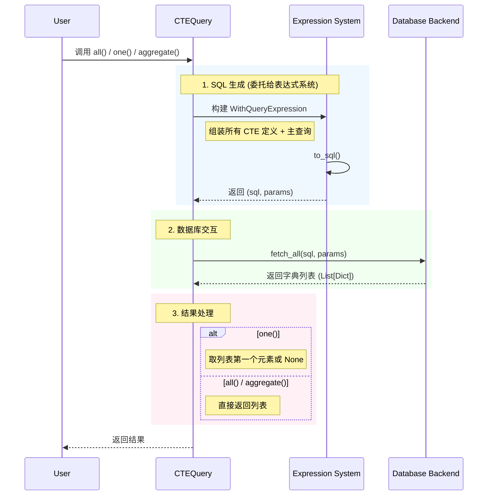

# CTEQuery (公用表表达式查询)

`CTEQuery` 用于构建公用表表达式（Common Table Expressions, CTEs），特别适用于递归查询或复杂的分析查询。

与 `ActiveQuery` 不同，`CTEQuery` **不绑定到特定的 Model**，查询结果通常以**字典**形式返回。

## 继承的能力

`CTEQuery` 同样支持 `ActiveQuery` 中的大多数查询构建 Mixin，用法保持一致：

*   **[BaseQueryMixin](active_query.md#basequerymixin-基础构建块)**: `select`, `where`, `order_by`, `limit` 等。
*   **[JoinQueryMixin](active_query.md#joinquerymixin-连接查询)**: `join` 等连接操作。
*   **[AggregateQueryMixin](active_query.md#aggregatequerymixin-聚合查询)**: `count`, `sum` 等聚合操作。
*   **[RangeQueryMixin](active_query.md#rangequerymixin-范围与便捷过滤)**: `in_list`, `like` 等便捷过滤。

## 独有方法

### `with_cte(name, query, columns=None, materialized=None)`

定义一个 CTE。

*   `name`: CTE 的名称。
*   `query`: 定义 CTE 的查询对象。
*   `columns`: 可选，指定 CTE 的列名。
*   `materialized`: 可选，控制 PostgreSQL 的 `MATERIALIZED` 选项。

### `recursive(enabled=True)`

开启递归模式（`WITH RECURSIVE`）。

### `query(main_query)`

指定主查询。如果不指定，默认查询最后一个定义的 CTE。

## 封装为预定义查询

与 `ActiveQuery` 类似，`CTEQuery` 的构建逻辑通常比较复杂。建议将其封装在 Model 的类方法中，以便复用。

```python
class Category(Model):
    # ...
    
    @classmethod
    def query_hierarchy(cls, root_id):
        """返回指定根节点下的整个分类树"""
        base_query = cls.query().where(cls.c.id == root_id)
        
        recursive_part = cls.query() \
            .join('category_tree', on='categories.parent_id = category_tree.id')
            
        union_query = base_query.union(recursive_part)
        
        return CTEQuery(cls.backend()) \
            .recursive(True) \
            .with_cte('category_tree', union_query) \
            .query(None) # 默认查询 CTE

# 使用
tree_data = Category.query_hierarchy(1).all()
```

## 执行方法

这些方法会触发数据库查询并返回结果。

> **为什么没有 `one()` 和 `all()` 方法？**
> 
> 与 `ActiveQuery` 不同，`CTEQuery` 不支持 `one()` 和 `all()` 方法。这是因为 CTE 查询的结果是原始数据字典，而不是模型实例。`one()` 和 `all()` 方法专门用于返回模型实例，而 CTE 查询的结果无法保证能够映射回单一的模型类型。

*   `aggregate() -> List[Dict[str, Any]]`: 执行查询并返回结果。
    *   支持 `explain()`：如果在调用此方法前调用了 `explain()`，将返回查询执行计划。
*   `to_sql() -> Tuple[str, List[Any]]`: 返回生成的 SQL 语句和参数。
    *   生成的 SQL 通常以 `WITH ...` 开头。

**同步异步对等**：`CTEQuery` 也有对应的异步版本 `AsyncCTEQuery`，两者具有相同的 API 和功能，唯一的区别是在异步版本中需要使用 `await` 关键字来调用 `aggregate()` 方法。

## 查询生命周期与执行流程

`CTEQuery` 的执行流程比 `ActiveQuery` 简单，因为它不涉及模型映射和关联加载。



**同步异步对等**：`CTEQuery` 也有对应的异步版本 `AsyncCTEQuery`，两者具有相同的 API 和功能，唯一的区别是在异步版本中需要使用 `await` 关键字。

## 用法示例

### 1. 基础 CTE (简化复杂逻辑)

假设我们要找出“高价值用户”（订单总额 > 1000），并查询他们的详细信息。

```python
from rhosocial.activerecord.query import CTEQuery
from rhosocial.activerecord.backend.expression import sum_

# 1. 定义 CTE：统计每个用户的订单总额
# SELECT user_id, SUM(amount) as total_amount FROM orders GROUP BY user_id
user_totals_cte = Order.query() \
    .select(Order.c.user_id, sum_(Order.c.amount).as_("total_amount")) \
    .group_by(Order.c.user_id)

# 2. 构建 CTE 查询
query = CTEQuery(User.backend()) \
    .with_cte("user_totals", user_totals_cte) \
    .query(
        # 主查询：连接 CTE 和 Users 表
        User.query().join("user_totals", on="users.id = user_totals.user_id") \
            .where("user_totals.total_amount > 1000")
    )

results = query.all() # 返回字典列表
```

### 2. 递归 CTE (层级遍历)

查询某个分类及其所有子分类（假设 `Category` 表有 `id` 和 `parent_id`）。

```python
# 1. 锚点成员 (Anchor Member)：顶级分类
base_query = Category.query().where(Category.c.id == 1)

# 2. 递归成员 (Recursive Member)：连接上一级结果
# 注意：在递归部分引用自身 CTE 名称
recursive_part = Category.query() \
    .join('category_tree', on='categories.parent_id = category_tree.id')

# 3. 组合 (UNION)
union_query = base_query.union(recursive_part)

# 4. 执行递归查询
cte_query = CTEQuery(Category.backend()) \
    .recursive(True) \
    .with_cte('category_tree', union_query) \
    .query(
        # 默认查询最后一个 CTE ('category_tree')
        None 
    )

results = cte_query.aggregate()
```

## 注意事项

1.  **返回类型**：`CTEQuery` 的结果始终是**字典列表** (`List[Dict[str, Any]]`)，不会自动转换为 Model 实例。
2.  **后端兼容性**：CTE 需要数据库支持（MySQL 8.0+, PostgreSQL, SQLite 3.8+）。
3.  **递归限制**：确保递归查询有终止条件，否则会导致死循环或栈溢出。
4.  **探索类成员**：如果您想了解 `CTEQuery` 类有哪些可用方法，可以使用 JetBrains PyCharm 或其他支持代码智能提示的 IDE。或者编写简单的脚本来检查类成员：
    ```python
    from rhosocial.activerecord.query.cte_query import CTEQuery
    methods = [method for method in dir(CTEQuery) if not method.startswith('_')]
    print("CTEQuery methods:", sorted(methods))
    ```
