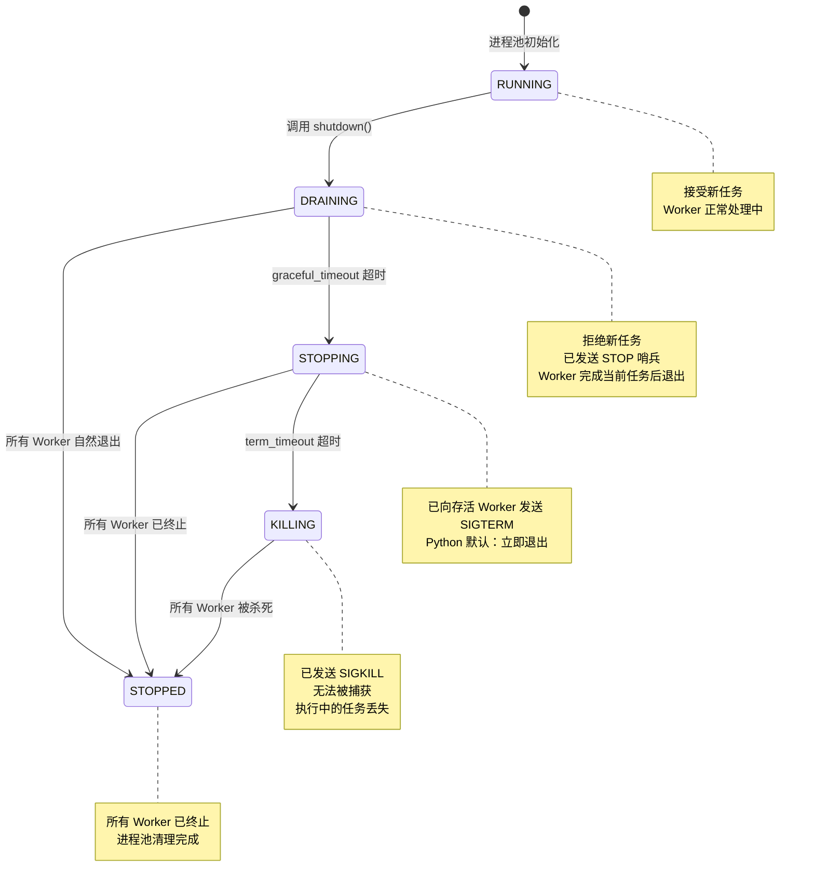

# Worker Pool 模块

`WorkerPool` 模块提供了一个简单、轻量级的驻留 Worker 进程池，用于并行任务执行。它采用 `spawn` 模式多进程，确保跨平台一致性。

## 目录

1. [概述](#1-概述)
2. [设计原则](#2-设计原则)
3. [快速开始](#3-快速开始)
4. [API 参考](#4-api-参考)
5. [任务编写指南](#5-任务编写指南)
6. [最佳实践](#6-最佳实践)
7. [常见陷阱](#7-常见陷阱)

---

## 1. 概述

### 什么是 WorkerPool？

`WorkerPool` 是一个驻留型 Worker 进程池，管理固定数量的 Worker 进程。与 `multiprocessing.Pool` 不同，`WorkerPool` 中的 Worker 在完成任务后保持存活，通过队列等待新任务。

### 核心特性

| 特性 | 描述 |
|------|------|
| **Spawn 模式** | 使用 `spawn` 上下文，跨平台一致 |
| **驻留 Worker** | Worker 持久存在，避免重复启动进程的开销 |
| **崩溃恢复** | Worker 崩溃后自动重启 |
| **任务追溯** | 即使 Worker 崩溃，失败任务也能被追踪 |
| **Future 模式** | 支持超时的异步结果处理 |
| **优雅停机** | 三段式停机：DRAINING → STOPPING → KILLING → STOPPED |

### 进程池状态机

停机过程中的状态转换：



### 适用场景

- **批量处理**：并行处理大量独立项目
- **任务队列**：用多个 Worker 处理队列中的任务
- **CPU 密集型工作**：跨进程分发 CPU 密集操作
- **I/O 密集型工作**：并行数据库查询或 API 调用

---

## 2. 设计原则

### WorkerPool 只管基础设施

核心设计理念：**WorkerPool 管理任务分发、结果收集和崩溃恢复 —— 其他一概不管。**

| WorkerPool 职责 | 用户职责 |
|----------------|---------|
| 进程生命周期管理 | 定义任务函数 |
| 任务队列管理 | 导入所需的 ORM 模型 |
| 结果收集 | 配置数据库连接 |
| Worker 健康监控 | 处理事务 |
| 崩溃恢复 | 管理连接生命周期 |

### 为什么这样设计？

最小化设计理念是有意为之的。尝试抽象更多功能的替代方案面临根本性挑战：

1. **Handler 注册无法跨进程**：全局状态在 `spawn` 后不存活，基于回调的模式不可靠
2. **动态导入不可靠**：模块路径往往无法在 Worker 进程中一致地解析
3. **模型序列化复杂**：ActiveRecord 实例包含数据库连接，无法直接 pickle

通过保持 `WorkerPool` 最小化，用户对其数据操作拥有完全的控制权和透明度。

---

## 3. 快速开始

### 基本用法

```python
from rhosocial.activerecord.worker import WorkerPool

# 定义任务函数（必须是模块级函数）
def double(n: int) -> int:
    return n * 2

# 使用 WorkerPool
if __name__ == '__main__':
    with WorkerPool(n_workers=4) as pool:
        # 提交单个任务
        future = pool.submit(double, 5)
        result = future.result(timeout=10)
        print(result)  # 输出: 10

        # 提交多个任务
        futures = [pool.submit(double, i) for i in range(10)]
        results = [f.result(timeout=10) for f in futures]
        print(results)  # 输出: [0, 2, 4, 6, 8, 10, 12, 14, 16, 18]
```

### 涉及数据库操作

```python
# task_functions.py - 独立模块存放任务定义
from typing import Optional

def submit_comment_task(params: dict) -> int:
    """
    提交评论任务。

    Args:
        params: 包含以下键的字典：
            - db_path: 数据库路径
            - post_id: 文章 ID
            - user_id: 用户 ID
            - content: 评论内容

    Returns:
        int: 新创建评论的 ID
    """
    db_path = params['db_path']
    post_id = params['post_id']
    user_id = params['user_id']
    content = params['content']

    # 1. 在 Worker 进程内配置数据库连接
    from rhosocial.activerecord.backend.impl.sqlite import SQLiteBackend
    from rhosocial.activerecord.backend.impl.sqlite.config import SQLiteConnectionConfig
    from myapp.models import User, Post, Comment

    config = SQLiteConnectionConfig(database=db_path)
    User.configure(config, SQLiteBackend)
    Post.__backend__ = User.backend()
    Comment.__backend__ = User.backend()

    comment_id: Optional[int] = None

    try:
        # 2. 在事务中执行业务逻辑
        with Post.transaction():
            post = Post.find_one(post_id)
            if post is None:
                raise ValueError(f"文章 {post_id} 不存在")

            user = User.find_one(user_id)
            if user is None:
                raise ValueError(f"用户 {user_id} 不存在")
            if not user.is_active:
                raise ValueError(f"用户 {user_id} 未激活")

            if post.status != 'published':
                raise ValueError(f"文章 {post_id} 未发布")

            comment = Comment(
                post_id=post.id,
                user_id=user_id,
                content=content
            )
            comment.save()
            comment_id = comment.id

        # 3. 返回结果
        return comment_id

    finally:
        # 4. 清理连接
        User.backend().disconnect()
```

```python
# main.py - 主程序
from rhosocial.activerecord.worker import WorkerPool
from task_functions import submit_comment_task

if __name__ == '__main__':
    with WorkerPool(n_workers=4) as pool:
        # 提交评论任务
        future = pool.submit(submit_comment_task, {
            'db_path': '/path/to/app.db',
            'post_id': 123,
            'user_id': 456,
            'content': '好文章！'
        })

        try:
            comment_id = future.result(timeout=30)
            print(f"评论已创建，ID: {comment_id}")
        except Exception as e:
            print(f"创建评论失败: {e}")
            if future.traceback:
                print(f"堆栈追踪:\n{future.traceback}")
```

---

## 4. API 参考

### WorkerPool

```python
class WorkerPool:
    """
    Spawn 模式驻留 Worker 进程池（带优雅停机）。

    Worker 进程启动后持续驻留。
    任务通过队列分发，结果通过 Future 获取。
    Worker 崩溃会触发自动重启。
    三段式停机：DRAINING → STOPPING → KILLING → STOPPED。
    """

    def __init__(self, n_workers: int = 4, check_interval: float = 0.5):
        """
        初始化 WorkerPool。

        Args:
            n_workers: Worker 进程数量
            check_interval: 监控线程检查 Worker 健康状态的间隔（秒）
        """

    def submit(self, fn: Callable, *args, **kwargs) -> Future:
        """
        提交任务，立即返回 Future。

        Args:
            fn: 任务函数（必须是模块级函数）
            *args: 位置参数
            **kwargs: 关键字参数

        Returns:
            Future: 异步结果句柄

        Raises:
            PoolDrainingError: Pool 处于停机流程时抛出

        Note:
            fn 和所有参数必须可 pickle 序列化（spawn 限制）。
        """

    def map(self, fn: Callable, iterable, timeout: Optional[float] = None) -> list:
        """
        批量提交，按顺序收集结果。

        Args:
            fn: 任务函数
            iterable: 参数迭代器
            timeout: 每个任务的超时时间（秒）

        Returns:
            list: 结果列表（与输入顺序相同）

        Raises:
            Exception: 任意任务失败时抛出
        """

    def shutdown(
        self,
        graceful_timeout: float = 10.0,
        term_timeout: float = 3.0,
    ) -> ShutdownReport:
        """
        三段式优雅停机。

        阶段一 · DRAINING（STOP 哨兵，等待自然退出）
        - 立即拒绝新 submit()（PoolDrainingError）
        - 向队列注入 STOP 哨兵
        - Worker 完成当前任务后读到哨兵，自行退出
        - 等待 graceful_timeout 秒

        阶段二 · STOPPING（SIGTERM）
        - graceful_timeout 到期仍有存活进程
        - 向所有存活 Worker 发送 SIGTERM
        - 等待 term_timeout 秒

        阶段三 · KILLING（SIGKILL）
        - term_timeout 到期仍有存活进程
        - 发送 SIGKILL（无法被捕获）
        - 正在执行的任务彻底丢失

        Args:
            graceful_timeout: 阶段一等待时间（默认 10s）
            term_timeout: 阶段二等待时间（默认 3s）

        Returns:
            ShutdownReport: 包含停机耗时、完成阶段、任务损耗等信息
        """

    @property
    def n_workers(self) -> int:
        """Worker 进程数量"""

    @property
    def active_workers(self) -> int:
        """存活的 Worker 进程数量"""

    @property
    def state(self) -> PoolState:
        """当前 Pool 状态"""
```

### PoolState

```python
class PoolState(Enum):
    """Pool 状态机（停机流程）。"""
    RUNNING = auto()   # 正常运行，接受任务
    DRAINING = auto()  # 拒绝新任务，等待执行中任务完成
    STOPPING = auto()  # 已发 SIGTERM
    KILLING = auto()   # 正在发 SIGKILL
    STOPPED = auto()   # 所有进程已终止
```

### ShutdownReport

```python
@dataclass
class ShutdownReport:
    """shutdown() 的返回值，描述停机过程。"""
    duration: float          # 停机总耗时（秒）
    final_phase: str         # 停机完成于哪个阶段："graceful" / "terminate" / "kill"
    tasks_in_flight: int     # 停机开始时正在执行的任务数
    tasks_killed: int        # SIGKILL 后仍持有任务的 Worker 数
    workers_killed: int      # exitcode == -9（被 SIGKILL）的 Worker 数
```

### 异常

```python
class PoolDrainingError(RuntimeError):
    """Pool 处于停机流程，不再接受新任务。"""

class TaskTimeoutError(TimeoutError):
    """任务执行超时。"""

class WorkerCrashedError(RuntimeError):
    """Worker 进程崩溃，任务未能完成。"""
```

### Future

```python
class Future:
    """
    异步结果句柄。

    线程安全，用于获取任务执行结果。
    """

    def result(self, timeout: Optional[float] = None) -> Any:
        """
        阻塞等待结果。

        Args:
            timeout: 超时时间（秒），None 表示无限等待

        Returns:
            任务返回值

        Raises:
            TimeoutError: 超时
            Exception: 任务抛出的原始异常
        """

    @property
    def done(self) -> bool:
        """任务是否已完成（成功或失败）"""

    @property
    def succeeded(self) -> bool:
        """任务是否成功"""

    @property
    def failed(self) -> bool:
        """任务是否失败"""

    @property
    def traceback(self) -> Optional[str]:
        """任务失败时返回完整的堆栈追踪字符串"""
```

---

## 5. 任务编写指南

### 任务函数规则

1. **必须是模块级函数**：嵌套/局部函数无法被 pickle
2. **必须可导入**：Worker 需要按名称导入函数
3. **参数必须可 pickle 序列化**：基本类型、字典、列表都可以
4. **返回值必须可 pickle 序列化**：与参数约束相同

### 任务函数模板

```python
# tasks.py - 专用模块存放任务函数

def my_task(params: dict) -> dict:
    """
    任务函数模板。

    Args:
        params: 任务参数（可序列化字典）

    Returns:
        结果字典（可序列化）
    """
    # 1. 提取参数
    db_path = params['db_path']
    # ... 其他参数

    # 2. 在 Worker 内配置连接
    from rhosocial.activerecord.backend.impl.sqlite import SQLiteBackend
    from rhosocial.activerecord.backend.impl.sqlite.config import SQLiteConnectionConfig
    from myapp.models import MyModel

    config = SQLiteConnectionConfig(database=db_path)
    MyModel.configure(config, SQLiteBackend)

    try:
        # 3. 执行业务逻辑
        with MyModel.transaction():
            # ... 执行操作
            result = {'status': 'success', 'data': some_value}
            return result

    finally:
        # 4. 始终清理连接
        MyModel.backend().disconnect()
```

### 错误处理

```python
def safe_task(params: dict) -> dict:
    """带正确错误处理的任务"""
    try:
        # ... 执行操作
        return {'success': True, 'data': result}
    except ValueError as e:
        # 业务逻辑错误 - 作为结果的一部分返回
        return {'success': False, 'error': str(e)}
    except Exception as e:
        # 意外错误 - 让它传播
        raise RuntimeError(f"任务失败: {e}")
```

---

## 6. 最佳实践

### 连接生命周期

始终遵循这个模式：

```python
def task(params):
    # 1. 开始时配置
    Model.configure(config, Backend)

    try:
        # 2. 执行操作
        return result
    finally:
        # 3. 始终断开连接
        Model.backend().disconnect()
```

### 事务管理

保持事务简短且专注：

```python
# 好的做法：单一、专注的事务
with Model.transaction():
    record = Model.find_one(id)
    record.status = 'processed'
    record.save()

# 不好的做法：多个事务，边界不清晰
with Model.transaction():
    record = Model.find_one(id)
# 事务结束了，但还在操作...
record.status = 'processed'  # 不在事务中！
record.save()
```

### 批量处理

简单批量操作使用 `map()`：

```python
def process_item(item_id: int) -> dict:
    # 处理单个项目
    return {'id': item_id, 'status': 'done'}

with WorkerPool(n_workers=4) as pool:
    results = pool.map(process_item, range(100))
```

需要共享设置的复杂批量操作：

```python
def batch_task(params: dict) -> list:
    """在一个任务中处理多个项目"""
    db_path = params['db_path']
    item_ids = params['item_ids']

    # 整个批次只配置一次
    Model.configure(config, Backend)

    try:
        results = []
        with Model.transaction():
            for item_id in item_ids:
                item = Model.find_one(item_id)
                # ... 处理
                results.append(item.id)
        return results
    finally:
        Model.backend().disconnect()

# 提交批次
batch_size = 10
with WorkerPool(n_workers=4) as pool:
    futures = []
    for i in range(0, 100, batch_size):
        batch = list(range(i, i + batch_size))
        futures.append(pool.submit(batch_task, {
            'db_path': 'app.db',
            'item_ids': batch
        }))
    results = [f.result() for f in futures]
```

### Worker 数量选择

| 场景 | 建议 |
|------|------|
| CPU 密集型任务 | `n_workers = cpu_count()` |
| I/O 密集型任务 | `n_workers = 2 * cpu_count()` |
| 数据库密集型 | `n_workers ≤ max_db_connections - 5`（预留管理连接） |
| 混合负载 | 从 `n_workers = cpu_count()` 开始，根据监控调优 |

### 优雅停机最佳实践

三段式停机确保任务优雅完成的同时防止无限等待：

```python
# 推荐：让上下文管理器处理停机
with WorkerPool(n_workers=4) as pool:
    futures = [pool.submit(task, i) for i in range(100)]
    results = [f.result() for f in futures]
# 上下文退出时自动触发停机，使用默认超时

# 手动停机，自定义超时
pool = WorkerPool(n_workers=4)
# ... 提交任务 ...
report = pool.shutdown(graceful_timeout=30.0, term_timeout=5.0)
print(f"停机耗时 {report.duration:.2f}s，完成于 {report.final_phase} 阶段")
```

**理解三个阶段：**

| 阶段 | 信号 | 行为 | 适用场景 |
|------|------|------|----------|
| DRAINING | STOP 哨兵 | Worker 完成当前任务后退出 | 正常停机 |
| STOPPING | SIGTERM | 立即终止（Python 默认） | 优雅超时已过 |
| KILLING | SIGKILL | 无法被捕获，进程立即消失 | TERM 超时已过 |

**STOP 哨兵与 SIGTERM 的关键区别：**

- **STOP 哨兵**：队列级礼貌请求。Worker 完成当前任务后读到哨兵，主动退出。
- **SIGTERM**：操作系统级信号。Python 默认处理器立即退出，打断当前任务。

```python
# 检查停机是否干净
report = pool.shutdown()
if report.final_phase != "graceful":
    print(f"警告：{report.tasks_killed} 个任务被强制终止")
```

---

## 7. 常见陷阱

### 陷阱 1：局部函数定义

```python
# 错误：嵌套函数无法被 pickle
def main():
    def my_task(n):
        return n * 2

    with WorkerPool() as pool:
        pool.submit(my_task, 5)  # PicklingError!

# 正确：模块级函数
def my_task(n):
    return n * 2

def main():
    with WorkerPool() as pool:
        pool.submit(my_task, 5)  # OK
```

### 陷阱 2：传递模型实例

```python
# 错误：模型实例可能无法正确序列化
user = User.find_one(1)
pool.submit(process_user, user)  # 可能失败

# 正确：传递 ID，让任务获取记录
pool.submit(process_user, user.id)

def process_user(user_id: int):
    User.configure(config, Backend)
    try:
        user = User.find_one(user_id)
        # ... 处理
    finally:
        User.backend().disconnect()
```

### 陷阱 3：忘记断开连接

```python
# 错误：连接泄漏
def my_task(params):
    Model.configure(config, Backend)
    return Model.find_one(params['id'])
    # 连接从未关闭！

# 正确：始终使用 try/finally
def my_task(params):
    Model.configure(config, Backend)
    try:
        return Model.find_one(params['id'])
    finally:
        Model.backend().disconnect()
```

### 陷阱 4：在任务外配置

```python
# 错误：在主进程配置，而不是 Worker 中
Model.configure(config, Backend)

def my_task(params):
    # Worker 没有这个配置！
    return Model.find_one(params['id'])

# 正确：在任务内配置
def my_task(params):
    Model.configure(config, Backend)
    try:
        return Model.find_one(params['id'])
    finally:
        Model.backend().disconnect()
```

### 陷阱 5：忽略 Worker 崩溃

```python
# 错误：不处理崩溃
future = pool.submit(risky_task, params)
result = future.result()  # 如果 Worker 崩溃可能抛出 RuntimeError

# 正确：优雅处理崩溃
future = pool.submit(risky_task, params)
try:
    result = future.result(timeout=30)
except RuntimeError as e:
    if "crashed" in str(e):
        print(f"Worker 崩溃: {e}")
        # 重试或适当处理
    else:
        raise
```

---

## 总结

`WorkerPool` 模块为并行任务执行提供了简单、可靠的基础。遵循这些准则：

1. 编写独立的模块级任务函数
2. 在每个任务内管理连接
3. 正确使用事务
4. 在 `finally` 中始终清理连接
5. 传递可序列化数据（ID，而非模型实例）

您可以构建与 `rhosocial-activerecord` 无缝集成的健壮并行处理工作流。
