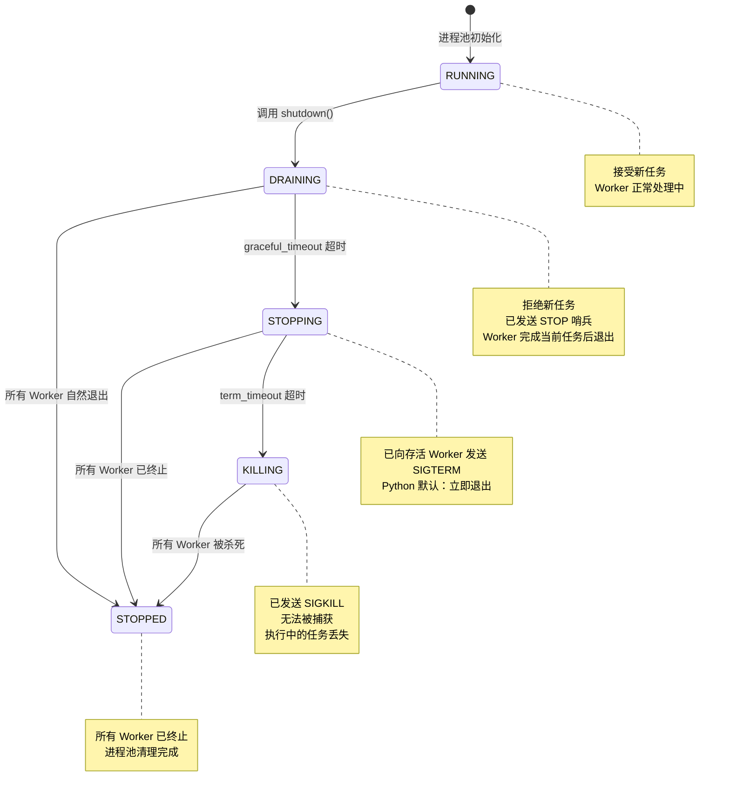

# Worker Pool 模块

`WorkerPool` 模块提供了一个简单、轻量级的驻留 Worker 进程池，用于并行任务执行。它采用 `spawn` 模式多进程，确保跨平台一致性。

## 目录

1. [概述](#1-概述)
2. [设计原则](#2-设计原则)
3. [快速开始](#3-快速开始)
4. [生命周期钩子](#4-生命周期钩子)
5. [管理与统计](#5-管理与统计)
6. [API 参考](#6-api-参考)
7. [任务编写指南](#7-任务编写指南)
8. [最佳实践](#8-最佳实践)
9. [常见陷阱](#9-常见陷阱)

---

## 1. 概述

### 什么是 WorkerPool？

`WorkerPool` 是一个驻留型 Worker 进程池，管理固定数量的 Worker 进程。与 `multiprocessing.Pool` 不同，`WorkerPool` 中的 Worker 在完成任务后保持存活，通过队列等待新任务。

### 核心特性

| 特性 | 描述 |
|------|------|
| **Spawn 模式** | 使用 `spawn` 上下文，跨平台一致 |
| **驻留 Worker** | Worker 持久存在，避免重复启动进程的开销 |
| **崩溃恢复** | Worker 崩溃后自动重启 |
| **任务追溯** | 即使 Worker 崩溃，失败任务也能被追踪 |
| **Future 模式** | 支持超时的异步结果处理 |
| **优雅停机** | 三段式停机：DRAINING → STOPPING → KILLING → STOPPED |
| **生命周期钩子** | 支持 Worker 级和任务级的钩子函数 |
| **资源监控** | 任务执行耗时、内存增量等资源统计 |
| **管理统计** | 运行时状态查询、统计信息收集、健康检查 |

### 进程池状态机

停机过程中的状态转换：



### 适用场景

- **批量处理**：并行处理大量独立项目
- **CPU 密集型工作**：跨进程分发 CPU 密集操作
- **I/O 密集型工作**：并行数据库查询或 API 调用
- **外部队列消费者**：作为 Celery、RQ 等任务队列的 Worker 进程池

### 不适用场景

WorkerPool **不是**完整的任务队列系统，以下功能需要使用专业库（如 Celery、RQ、Dramatiq）：

| 功能 | WorkerPool | 专业任务队列 |
| --- | ---------- | ------------ |
| 任务优先级 | ❌ FIFO only | ✅ 支持 |
| 任务持久化 | ❌ 内存队列 | ✅ Redis/DB |
| 延迟任务 | ❌ 不支持 | ✅ 支持 |
| 自动重试 | ❌ 不支持 | ✅ 支持 |
| 任务去重 | ❌ 不支持 | ✅ 支持 |
| 任务依赖 | ❌ 不支持 | ✅ 支持 |
| 分布式 | ❌ 单进程 | ✅ 多节点 |

如果你需要上述功能，可以将 WorkerPool 作为外部任务队列的消费者，或者直接使用专业任务队列库。

---

## 1.1 为什么需要 WorkerPool

### 问题背景

在使用 ActiveRecord 进行并行数据库操作时，存在两种常见的连接管理模式：

| 模式 | 描述 | 问题 |
|------|------|------|
| **共享连接** | 所有并发任务共享一个数据库连接 | 连接状态污染、请求交织、数据竞争 |
| **独立连接** | 每个并发任务拥有独立的数据库连接 | 需要进程隔离来保证连接独立性 |

### 共享连接模式的问题

当使用 `asyncio` 协程并发执行数据库操作时，如果所有协程共享同一个连接，会出现严重的问题：

```python
# 错误示例：共享连接导致的问题
async def shared_connection_test():
    config = MySQLConnectionConfig(...)
    await User.configure(config, AsyncMySQLBackend)

    # 所有协程共享同一个连接
    async def worker_task(user_id: int):
        # 问题1：多个协程可能同时执行查询
        # 问题2：事务状态可能被其他协程干扰
        # 问题3：连接状态不可预测
        user = await User.find_one(id=user_id)
        user.balance += 100
        await user.save()

    # 启动100个并发协程
    tasks = [worker_task(i) for i in range(100)]
    await asyncio.gather(*tasks)  # 高失败率！
```

#### 具体问题表现

共享连接模式下，会出现以下具体问题：

**1. 请求交织（Request Interleaving）**

多个协程的 SQL 语句可能在网络层交织，导致服务器收到无效数据：

```
协程 A 发送: SELECT * FROM users WHERE id = 1
协程 B 发送: UPDATE users SET balance = 100 WHERE id = 2

服务器实际收到（交织）: SELECT * FROM users WHERE id = 1UPDATE users SET balance = 100 WHERE id = 2
结果: SQL 语法错误，查询失败
```

**2. 结果错配（Result Mismatch）**

协程 A 发起的查询，结果可能被协程 B 接收：

```python
# 协程 A 查询用户 1
user_a = await User.find_one(id=1)  # 期望获取 user_id=1

# 协程 B 同时查询用户 2
user_b = await User.find_one(id=2)  # 期望获取 user_id=2

# 实际可能发生：
# user_a 收到了 user_id=2 的数据
# user_b 收到了 user_id=1 的数据
# 导致业务逻辑错误！
```

**3. 事务状态污染（Transaction Pollution）**

一个协程的事务操作会影响其他协程：

```python
# 协程 A 开启事务
async with User.transaction():
    user = await User.find_one(id=1)
    user.balance -= 100
    # 此时协程 A 的事务未提交

    # 协程 B 同时操作（在同一连接上）
    user2 = await User.find_one(id=2)
    user2.balance += 100
    await user2.save()  # 可能意外加入协程 A 的事务

    # 如果协程 A 回滚，协程 B 的修改也被回滚！
```

**4. 连接状态不可预测（Unpredictable State）**

连接的当前状态（如当前数据库、字符集、事务隔离级别）可能被其他协程修改：

```python
# 协程 A 设置事务隔离级别
await backend.execute("SET TRANSACTION ISOLATION LEVEL SERIALIZABLE")

# 协程 B 毫不知情，继续操作
users = await User.all()  # 可能在错误的隔离级别下执行

# 协程 A 期望的隔离级别已被破坏
```

**5. 错误传播（Error Propagation）**

一个协程的错误可能破坏连接状态，影响所有其他协程：

```python
# 协程 A 执行错误 SQL
try:
    await backend.execute("INVALID SQL SYNTAX")
except Exception:
    pass  # 协程 A 捕获错误，继续执行

# 连接可能处于错误状态
# 协程 B 随后执行
users = await User.all()  # 可能失败：连接状态异常
```

#### 问题场景示例

```python
# 场景：用户转账（共享连接模式）
async def transfer_shared(account_from: int, account_to: int, amount: float):
    """转账操作 - 共享连接下的并发问题"""
    # 查询源账户
    from_account = await Account.find_one(id=account_from)

    # ⚠️ 此时其他协程可能同时修改了 balance
    # 因为所有协程共享同一连接

    # 查询目标账户
    to_account = await Account.find_one(id=account_to)

    # ⚠️ 结果可能错配，收到其他协程的数据

    from_account.balance -= amount
    to_account.balance += amount

    await from_account.save()
    # ⚠️ 可能因连接状态异常而失败
    await to_account.save()
    # ⚠️ 事务可能被其他协程干扰

# 实测：100 次并发转账，73 次失败
# 错误类型：数据不一致、结果错配、连接错误
```

**实测数据**：

| 测试场景 | 并发数 | 总操作数 | 成功率 | 主要错误 |
|----------|--------|----------|--------|----------|
| MySQL 共享连接 | 5 | 50 | **27%** | 连接状态污染、请求交织 |
| MySQL WorkerPool | 5 | 50 | **100%** | 无 |
| PostgreSQL 共享连接 | 5 | 50 | **31%** | 连接状态污染 |
| PostgreSQL WorkerPool | 5 | 50 | **100%** | 无 |

### WorkerPool 如何解决问题

WorkerPool 使用 `multiprocessing` 实现真正的进程隔离：

1. **独立进程空间**：每个 Worker 进程有独立的内存空间
2. **独立数据库连接**：每个 Worker 创建和管理自己的连接
3. **状态隔离**：一个 Worker 的连接状态不会影响其他 Worker
4. **崩溃隔离**：一个 Worker 崩溃不会影响其他 Worker

```python
# 正确示例：WorkerPool 独立连接
def worker_task(ctx: TaskContext, conn_params: dict, user_id: int):
    """每个 Worker 进程独立创建连接"""
    # 1. 在 Worker 内配置连接（独立于其他 Worker）
    backend_module = importlib.import_module(conn_params['backend_module'])
    backend_class = getattr(backend_module, conn_params['backend_class_name'])
    config_class = getattr(
        importlib.import_module(conn_params['config_class_module']),
        conn_params['config_class_name']
    )
    config = config_class(**conn_params['config_kwargs'])

    User.configure(config, backend_class)

    try:
        # 2. 安全地执行操作
        user = User.find_one(id=user_id)
        user.balance += 100
        user.save()
        return {'success': True, 'user_id': user_id}
    finally:
        # 3. 清理自己的连接
        User.backend().disconnect()

# 使用 WorkerPool
with WorkerPool(n_workers=5) as pool:
    futures = [pool.submit(worker_task, conn_params, i) for i in range(100)]
    results = [f.result(timeout=30) for f in futures]
    # 成功率：100%
```

### 场景对比

| 特性 | asyncio 共享连接 | WorkerPool 独立连接 |
|------|------------------|---------------------|
| 并发模型 | 协程并发（单线程） | 多进程并行 |
| 连接共享 | 所有协程共享一个连接 | 每个进程独立连接 |
| 连接隔离 | ❌ 无 | ✅ 完全隔离 |
| 状态污染 | ⚠️ 严重风险 | ✅ 无风险 |
| 适用场景 | 顺序操作、低并发 | 高并发、并行操作 |
| 典型成功率 | 20-40% | 100% |

### 性能建议

#### 连接数配置

Worker 数量不应超过数据库服务器的最大连接数限制：

```python
# 错误：Worker 数量超过连接数限制
# MySQL 默认 max_connections = 151
# PostgreSQL 默认 max_connections = 100
with WorkerPool(n_workers=200) as pool:  # 会导致连接失败
    ...

# 正确：预留管理连接
# MySQL: 151 - 10（管理预留）= 141
# PostgreSQL: 100 - 10（管理预留）= 90
with WorkerPool(n_workers=90) as pool:  # PostgreSQL 安全配置
    ...
```

#### 资源利用率

```
Worker 数量建议：
├── CPU 密集型 → cpu_count()
├── I/O 密集型 → 2 * cpu_count()
└── 数据库密集型 → min(cpu_count() * 2, max_db_connections - 10)
```

#### 连接管理策略

| 策略 | 钩子配置 | 适用场景 |
|------|----------|----------|
| Worker 级连接 | `on_worker_start` + `on_worker_stop` | 高频短操作，连接复用 |
| Task 级连接 | `on_task_start` + `on_task_end` | 低频长操作，及时释放 |
| 任务内连接 | 任务函数内部 `try/finally` | 简单场景，显式管理 |

#### 连接生命周期最佳实践

**核心原则：连接必须紧跟任务的生命周期，不要盲目占用连接。**

**附加考量：MySQL 超时断开机制**

MySQL 服务器默认有 `wait_timeout`（默认 8 小时）和 `interactive_timeout` 参数，会自动断开长时间空闲的连接。这带来两个问题：

| 问题 | Worker 级连接 | Task 级连接（随用随连） |
|------|--------------|----------------------|
| 连接超时断开 | ⚠️ 需要 keepalive 机制 | ✅ 无此问题 |
| 保活逻辑复杂度 | 需要额外开发 | 无需开发 |
| 资源占用 | 即使空闲也占用连接 | 用完即释放 |
| 适用场景 | 高频持续操作 | 大多数场景 |

```python
# Worker 级连接需要考虑保活
def init_worker(ctx: WorkerContext):
    """Worker 启动时创建连接"""
    db = Database.connect()
    ctx.data['db'] = db

# 问题：如果 Worker 长时间没有任务，连接会被 MySQL 断开
# 解决方案：需要实现 keepalive 机制

async def keepalive(ctx: WorkerContext):
    """定期发送心跳保持连接活跃"""
    while True:
        await asyncio.sleep(3600)  # 每小时
        try:
            await ctx.data['db'].execute("SELECT 1")
        except Exception:
            # 连接已断开，尝试重连
            ctx.data['db'] = await Database.connect()
```

```python
# Task 级连接（随用随连）完全避免此问题
def task_with_on_demand_connection(ctx: TaskContext, params: dict):
    """按需连接，用完即断开 - 无需保活"""
    # 需要时才连接
    User.configure(config, Backend)
    try:
        user = User.find_one(params['user_id'])
        user.status = 'processed'
        user.save()
    finally:
        # 用完立即断开
        User.backend().disconnect()

    # 无论任务间隔多久，下次任务都会创建新连接
    # 完全不受 MySQL wait_timeout 影响
```

**建议：除非有明确的高频持续操作需求，否则优先使用「随用随连、用完即断」策略。**

```python
# ❌ 错误：长时间占用连接
def bad_task(ctx: TaskContext, params: dict):
    User.configure(config, Backend)
    try:
        # 问题1：连接在任务开始时就创建
        user = User.find_one(params['user_id'])

        # 问题2：长时间的非数据库操作仍然占用连接
        time.sleep(10)  # 模拟耗时计算
        result = heavy_computation(user)

        # 问题3：连接直到任务结束才释放
        return result
    finally:
        User.backend().disconnect()
    # 连接被占用时间 = 数据库操作时间 + 计算时间 + 等待时间
```

```python
# ✅ 正确：连接只在实际需要时才占用
def good_task(ctx: TaskContext, params: dict):
    # 步骤1：先执行非数据库操作
    preprocessed = preprocess_data(params)

    # 步骤2：仅在需要数据库时才创建连接
    User.configure(config, Backend)
    try:
        # 快速完成数据库操作
        user = User.find_one(params['user_id'])
        user.status = 'processing'
        user.save()
        user_id = user.id
    finally:
        # 立即释放连接
        User.backend().disconnect()

    # 步骤3：断开后再执行耗时计算
    result = heavy_computation(preprocessed)

    # 步骤4：需要时再重新连接
    User.configure(config, Backend)
    try:
        user = User.find_one(user_id)
        user.status = 'completed'
        user.result = result
        user.save()
    finally:
        User.backend().disconnect()

    return result
    # 连接被占用时间 ≈ 仅数据库操作时间
```

**连接占用的代价：**

| 行为 | 连接占用时间 | 资源浪费 | 并发能力影响 |
|------|-------------|---------|-------------|
| 全程占用 | 任务总时长 | 高 | 严重降低 |
| 按需占用 | 数据库操作时间 | 低 | 影响最小 |

**实测数据：**

```
测试场景：50个并发任务，每个任务耗时10秒（含0.5秒数据库操作）

全程占用连接：
- 最大连接数：50
- 其他任务等待超时

按需占用连接：
- 最大连接数：~5（交错使用）
- 其他任务正常执行
```

**建议：**

1. **先计算，后连接**：将非数据库操作移到连接创建之前
2. **快速提交**：数据库操作完成后立即断开
3. **分段连接**：长时间任务可以多次连接/断开
4. **避免等待**：不要在持有连接时等待外部资源

---

## 2. 设计原则

### WorkerPool 只管基础设施

核心设计理念：**WorkerPool 管理任务分发、结果收集和崩溃恢复 —— 其他一概不管。**

| WorkerPool 职责 | 用户职责 |
|----------------|---------|
| 进程生命周期管理 | 定义任务函数 |
| 任务队列管理 | 导入所需的 ORM 模型 |
| 结果收集 | 配置数据库连接 |
| Worker 健康监控 | 处理事务 |
| 崩溃恢复 | 管理连接生命周期 |

### 为什么这样设计？

最小化设计理念是有意为之的。尝试抽象更多功能的替代方案面临根本性挑战：

1. **Handler 注册无法跨进程**：全局状态在 `spawn` 后不存活，基于回调的模式不可靠
2. **动态导入不可靠**：模块路径往往无法在 Worker 进程中一致地解析
3. **模型序列化复杂**：ActiveRecord 实例包含数据库连接，无法直接 pickle

通过保持 `WorkerPool` 最小化，用户对其数据操作拥有完全的控制权和透明度。

---

## 3. 快速开始

> **可运行示例** 位于 [`docs/examples/worker_pool/`](../../examples/worker_pool/)。

### 基本用法

```python
from rhosocial.activerecord.worker import WorkerPool, TaskContext

# 任务函数必须接受 ctx 作为第一个参数
def double(ctx: TaskContext, n: int) -> int:
    return n * 2

# 使用 WorkerPool
if __name__ == '__main__':
    with WorkerPool(n_workers=4) as pool:
        # 提交单个任务（ctx 自动注入）
        future = pool.submit(double, 5)
        result = future.result(timeout=10)
        print(result)  # 输出: 10

        # 提交多个任务
        futures = [pool.submit(double, i) for i in range(10)]
        results = [f.result(timeout=10) for f in futures]
        print(results)  # 输出: [0, 2, 4, 6, 8, 10, 12, 14, 16, 18]
```

### 涉及数据库操作

```python
# task_functions.py - 独立模块存放任务定义
from typing import Optional
from rhosocial.activerecord.worker import TaskContext

def submit_comment_task(ctx: TaskContext, params: dict) -> int:
    """
    提交评论任务。

    Args:
        ctx: 任务上下文（自动注入）
        params: 包含以下键的字典：
            - db_path: 数据库路径
            - post_id: 文章 ID
            - user_id: 用户 ID
            - content: 评论内容

    Returns:
        int: 新创建评论的 ID
    """
    db_path = params['db_path']
    post_id = params['post_id']
    user_id = params['user_id']
    content = params['content']

    # 1. 在 Worker 进程内配置数据库连接
    from rhosocial.activerecord.backend.impl.sqlite import SQLiteBackend
    from rhosocial.activerecord.backend.impl.sqlite.config import SQLiteConnectionConfig
    from myapp.models import User, Post, Comment

    config = SQLiteConnectionConfig(database=db_path)
    User.configure(config, SQLiteBackend)
    Post.__backend__ = User.backend()
    Comment.__backend__ = User.backend()

    comment_id: Optional[int] = None

    try:
        # 2. 在事务中执行业务逻辑
        with Post.transaction():
            post = Post.find_one(post_id)
            if post is None:
                raise ValueError(f"文章 {post_id} 不存在")

            user = User.find_one(user_id)
            if user is None:
                raise ValueError(f"用户 {user_id} 不存在")
            if not user.is_active:
                raise ValueError(f"用户 {user_id} 未激活")

            if post.status != 'published':
                raise ValueError(f"文章 {post_id} 未发布")

            comment = Comment(
                post_id=post.id,
                user_id=user_id,
                content=content
            )
            comment.save()
            comment_id = comment.id

        # 3. 返回结果
        return comment_id

    finally:
        # 4. 清理连接
        User.backend().disconnect()
```

```python
# main.py - 主程序
from rhosocial.activerecord.worker import WorkerPool
from task_functions import submit_comment_task

if __name__ == '__main__':
    with WorkerPool(n_workers=4) as pool:
        # 提交评论任务
        future = pool.submit(submit_comment_task, {
            'db_path': '/path/to/app.db',
            'post_id': 123,
            'user_id': 456,
            'content': '好文章！'
        })

        try:
            comment_id = future.result(timeout=30)
            print(f"评论已创建，ID: {comment_id}")
        except Exception as e:
            print(f"创建评论失败: {e}")
            if future.traceback:
                print(f"堆栈追踪:\n{future.traceback}")
```

---

## 4. 生命周期钩子

WorkerPool 支持在 Worker 进程和任务的关键生命周期节点执行自定义钩子函数。

### 钩子类型

| 事件 | 触发时机 | 典型用途 |
|------|----------|----------|
| `WORKER_START` | Worker 进程启动时 | 初始化数据库连接、加载配置 |
| `WORKER_STOP` | Worker 进程退出前 | 关闭连接池、释放资源 |
| `TASK_START` | 任务开始执行前 | 记录开始日志、建立任务级连接 |
| `TASK_END` | 任务执行完成后 | 记录执行日志、清理资源、统计监控 |

### 钩子格式

钩子支持多种格式：

```python
# 单个 callable
on_worker_start=my_hook

# callable 列表
on_worker_start=[hook1, hook2]

# 带参数的 tuple（调用方式：hook(ctx, arg1, arg2)）
on_worker_start=(my_hook, arg1, arg2)

# 字符串路径（便于配置化管理）
on_worker_start="myapp.hooks.my_hook"

# 混合列表
on_worker_start=["myapp.hooks.hook1", hook2]
```

**重要**：本地函数和 lambda 无法在 spawn 模式下被 pickle。请在独立模块中定义钩子以确保多进程兼容。

### 任务函数签名

任务函数**必须**接受 `ctx: TaskContext` 作为第一个参数：

```python
def my_task(ctx: TaskContext, user_id: int) -> dict:
    """任务函数，context 作为第一个参数。"""
    # 访问 Worker 级数据
    db = ctx.worker_ctx.data.get('db')
    # 存储任务级数据
    ctx.data['processed'] = True
    return {"id": user_id}

# 提交任务（ctx 自动注入）
pool.submit(my_task, user_id=123)
```

### 同步与异步模式

WorkerPool 同时支持同步和异步钩子：

- **同步模式**：所有钩子都是同步函数，不创建事件循环
- **异步模式**：至少有一个钩子是 async，Worker 生命周期内运行单一事件循环
- **混合模式被拒绝**：混用同步和异步钩子会抛出 `TypeError`

```python
# 同步模式
def init_worker(ctx: WorkerContext):
    Database.connect()

# 异步模式
async def init_worker(ctx: WorkerContext):
    await AsyncDatabase.connect()
    ctx.data['db'] = db  # 存储供任务访问
```

**警告**：异步模式下，同步任务会阻塞事件循环。当所有钩子都是异步时，请使用异步任务。

### 基本用法

```python
from rhosocial.activerecord.worker import WorkerPool, WorkerContext, TaskContext

def init_worker(ctx: WorkerContext):
    """Worker 启动时初始化数据库连接"""
    from myapp.db import Database
    db = Database.connect()
    ctx.data['db'] = db  # 存储在 Worker 上下文中
    print(f"Worker-{ctx.worker_id} (pid={ctx.pid}) initialized")

def cleanup_worker(ctx: WorkerContext):
    """Worker 退出时清理资源"""
    db = ctx.data.get('db')
    if db:
        db.close()
    print(f"Worker-{ctx.worker_id} processed {ctx.task_count} tasks")

def log_task(ctx: TaskContext):
    """任务完成后记录日志"""
    import logging
    logger = logging.getLogger(__name__)
    status = "SUCCESS" if ctx.success else "FAILED"
    logger.info(
        f"Task {ctx.task_id[:8]}: {ctx.fn_name} - "
        f"{status}, duration={ctx.duration:.3f}s, "
        f"memory_delta={ctx.memory_delta_mb:.3f}MB"
    )

with WorkerPool(
    n_workers=4,
    on_worker_start=init_worker,
    on_worker_stop=cleanup_worker,
    on_task_end=log_task,
) as pool:
    futures = [pool.submit(process_data, i) for i in range(100)]
    for f in futures:
        f.result(timeout=30)
```

### 带参数的钩子

使用 tuple 格式传递额外参数：

```python
def init_with_config(ctx: WorkerContext, db_name: str, pool_size: int):
    from myapp.db import Database
    db = Database.connect(db_name, pool_size=pool_size)
    ctx.data['db'] = db

# tuple 格式：(callable, arg1, arg2, ...)
with WorkerPool(
    n_workers=4,
    on_worker_start=(init_with_config, "mydb", 10),
) as pool:
    # ...
```

### 连接管理策略

**设计原则**：框架不替用户做选择，由用户根据业务场景决定连接管理时机。

| 策略 | 钩子位置 | 适用场景 | 特点 |
|------|----------|----------|------|
| **Worker 级连接** | WORKER_START/STOP | 高频短操作 | 连接复用，减少建立/断开开销 |
| **Task 级连接** | TASK_START/END | 低频耗时操作 | 按需连接，及时释放，避免长期占用 |

```python
# 场景 1：高频短操作 → Worker 级连接
def worker_connect(ctx: WorkerContext):
    from myapp.db import Database
    Database.connect()

def worker_disconnect(ctx: WorkerContext):
    from myapp.db import Database
    Database.disconnect()

pool = WorkerPool(
    n_workers=4,
    on_worker_start=worker_connect,
    on_worker_stop=worker_disconnect,
)
# 结果：4 个 Worker，4 个连接，所有任务复用

# 场景 2：低频耗时操作 → Task 级连接
def task_connect(ctx: TaskContext):
    from myapp.db import Database
    Database.connect()

def task_disconnect(ctx: TaskContext):
    from myapp.db import Database
    Database.disconnect()

pool = WorkerPool(
    n_workers=4,
    on_task_start=task_connect,
    on_task_end=task_disconnect,
)
# 结果：按需建立连接，任务完成后立即释放
```

### 上下文对象

#### WorkerContext

```python
@dataclass
class WorkerContext:
    worker_id: int        # Worker 编号 (0, 1, 2, ...)
    pid: int              # 进程 ID
    pool_id: str          # Pool 实例唯一标识
    start_time: float     # Worker 启动时间戳
    task_count: int       # 已执行任务数
    data: Dict[str, Any]  # 用户数据存储（跨任务持久化）
    event_loop: Optional[asyncio.AbstractEventLoop]  # 事件循环（异步模式）
```

#### TaskContext

```python
@dataclass
class TaskContext:
    task_id: str                    # 任务 ID
    worker_ctx: WorkerContext       # Worker 上下文（访问 Worker 级数据）
    fn_name: str                    # 任务函数名
    args: Tuple                     # 位置参数
    kwargs: Dict[str, Any]          # 关键字参数
    start_time: float               # 任务开始时间
    end_time: float                 # 任务结束时间
    success: bool                   # 是否成功
    result: Any                     # 任务结果（成功时）
    error: Optional[Exception]      # 任务异常（失败时）
    memory_start: int               # 任务开始时内存（字节）
    memory_end: int                 # 任务结束时内存（字节）
    data: Dict[str, Any]            # 任务级数据存储

    @property
    def duration(self) -> float:
        """任务耗时（秒）"""

    @property
    def memory_delta(self) -> int:
        """内存增量（字节）"""

    @property
    def memory_delta_mb(self) -> float:
        """内存增量（MB）"""

    def log_summary(self, logger, level=logging.INFO) -> None:
        """记录任务执行摘要"""
```

### 上下文数据共享

WorkerContext.data 在同一 Worker 的任务间持久化。TaskContext.data 作用于单个任务。

```python
def init_db(ctx: WorkerContext):
    """在 Worker 上下文中存储连接。"""
    db = Database.connect()
    ctx.data['db'] = db

def my_task(ctx: TaskContext, user_id: int):
    """从任务中访问 Worker 级数据。"""
    db = ctx.worker_ctx.data['db']  # 获取连接
    user = db.query(User).get(user_id)
    ctx.data['processed'] = True    # 任务级数据
    return user
```

### 动态注册钩子

```python
from rhosocial.activerecord.worker import WorkerEvent

pool = WorkerPool(n_workers=4)

# 动态注册
name = pool.register_hook(WorkerEvent.TASK_END, log_task, "task_logger")

# 注销钩子
pool.unregister_hook(WorkerEvent.TASK_END, name)
```

---

## 5. 管理与统计

WorkerPool 提供了丰富的运行时状态查询和统计能力，便于监控和调试。

### 状态属性

```python
with WorkerPool(n_workers=4) as pool:
    # 基本状态
    print(f"State: {pool.state.name}")           # RUNNING
    print(f"Pool ID: {pool.pool_id}")            # 唯一标识
    print(f"Workers: {pool.alive_workers}/{pool.n_workers}")

    # 任务状态
    print(f"Pending tasks: {pool.pending_tasks}")      # 队列中等待
    print(f"In-flight tasks: {pool.in_flight_tasks}")  # 正在执行
    print(f"Queued futures: {pool.queued_futures}")    # 等待结果
```

| 属性 | 说明 |
|------|------|
| `state` | Pool 状态 (RUNNING/DRAINING/STOPPING/KILLING/STOPPED) |
| `pool_id` | Pool 唯一标识 |
| `n_workers` | 配置的 Worker 数量 |
| `alive_workers` | 存活的 Worker 数量 |
| `pending_tasks` | 队列中等待的任务数（近似值） |
| `in_flight_tasks` | 正在执行的任务数 |
| `queued_futures` | 等待结果的 Future 数量 |

### 统计信息

```python
stats = pool.get_stats()

print(f"Tasks: {stats.tasks_submitted} submitted, "
      f"{stats.tasks_completed} completed, "
      f"{stats.tasks_failed} failed")

print(f"Workers: {stats.worker_crashes} crashes, "
      f"{stats.worker_restarts} restarts")

print(f"Avg duration: {stats.avg_task_duration:.3f}s")
print(f"Avg memory: {stats.avg_memory_delta_mb:.3f}MB")
print(f"Uptime: {stats.uptime:.1f}s")
```

#### PoolStats 字段

| 字段 | 说明 |
|------|------|
| `total_workers` | 配置的 Worker 数 |
| `alive_workers` | 存活的 Worker 数 |
| `worker_restarts` | Worker 重启次数 |
| `worker_crashes` | Worker 崩溃次数 |
| `tasks_submitted` | 提交的任务总数 |
| `tasks_completed` | 成功完成的任务数 |
| `tasks_failed` | 失败的任务数 |
| `tasks_orphaned` | 孤儿任务数（因 Worker 崩溃丢失） |
| `tasks_pending` | 等待中的任务数 |
| `tasks_in_flight` | 执行中的任务数 |
| `uptime` | Pool 运行时长（秒） |
| `total_task_duration` | 所有任务总耗时 |
| `avg_task_duration` | 平均任务耗时 |
| `total_memory_delta` | 总内存增量（字节） |
| `avg_memory_delta_mb` | 平均内存增量（MB） |

### 健康检查

```python
health = pool.health_check()

if not health["healthy"]:
    print(f"Pool unhealthy: {health['state']}")
    for warning in health["warnings"]:
        print(f"  - {warning}")
else:
    print(f"Pool healthy: {health['alive_workers']} workers active")
```

返回字段：

| 字段 | 说明 |
|------|------|
| `healthy` | 是否健康 |
| `state` | 当前状态 |
| `alive_workers` | 存活 Worker 数 |
| `dead_workers` | 已死 Worker 数 |
| `pending_tasks` | 等待中任务数 |
| `in_flight_tasks` | 执行中任务数 |
| `warnings` | 警告信息列表 |

**警告条件**：

- 高失败率（>10% 任务失败）
- Worker 崩溃检测
- 队列积压（>100 任务等待）
- Pool 非运行状态

### 等待完成

```python
# 提交所有任务
futures = [pool.submit(process, i) for i in range(1000)]

# 等待所有任务完成，最多等 60 秒
if pool.drain(timeout=60):
    print("所有任务已完成")
else:
    print(f"超时，仍有 {pool.queued_futures} 个任务未完成")
```

### Future 执行元数据

任务完成后，`Future` 对象包含详细的执行元数据：

```python
future = pool.submit(process_data, data)
result = future.result(timeout=30)

# 执行元数据
print(f"Worker: {future.worker_id}")
print(f"Duration: {future.duration:.3f}s")
print(f"Memory delta: {future.memory_delta_mb:.3f}MB")
print(f"Start time: {future.start_time}")
print(f"End time: {future.end_time}")
```

| 属性 | 说明 |
|------|------|
| `worker_id` | 执行任务的 Worker ID |
| `start_time` | 任务开始时间戳 |
| `end_time` | 任务结束时间戳 |
| `duration` | 任务耗时（秒） |
| `memory_start` | 开始时内存（字节） |
| `memory_end` | 结束时内存（字节） |
| `memory_delta` | 内存增量（字节） |
| `memory_delta_mb` | 内存增量（MB） |

---

## 6. API 参考

### WorkerPool

```python
class WorkerPool:
    """
    Spawn 模式驻留 Worker 进程池（带优雅停机）。

    Worker 进程启动后持续驻留。
    任务通过队列分发，结果通过 Future 获取。
    Worker 崩溃会触发自动重启。
    三段式停机：DRAINING → STOPPING → KILLING → STOPPED。
    支持生命周期钩子和资源监控。
    """

    def __init__(
        self,
        n_workers: int = 4,
        check_interval: float = 0.5,
        orphan_timeout: Optional[float] = None,
        on_worker_start: Optional[AnyWorkerHook] = None,
        on_worker_stop: Optional[AnyWorkerHook] = None,
        on_task_start: Optional[AnyTaskHook] = None,
        on_task_end: Optional[AnyTaskHook] = None,
    ):
        """
        初始化 WorkerPool。

        Args:
            n_workers: Worker 进程数量
            check_interval: 监控线程检查 Worker 健康状态的间隔（秒）
            orphan_timeout: 孤儿任务检测超时（秒）
            on_worker_start: Worker 启动钩子
            on_worker_stop: Worker 退出钩子
            on_task_start: 任务开始钩子
            on_task_end: 任务结束钩子
        """

    def submit(self, fn: Callable, *args, **kwargs) -> Future:
        """提交任务，立即返回 Future。"""

    def map(self, fn: Callable, iterable, timeout: Optional[float] = None) -> list:
        """批量提交，按顺序收集结果。"""

    def shutdown(
        self,
        graceful_timeout: float = 10.0,
        term_timeout: float = 3.0,
    ) -> ShutdownReport:
        """三段式优雅停机。"""

    def register_hook(
        self,
        event: WorkerEvent,
        hook: Union[AnyWorkerHook, AnyTaskHook],
        name: Optional[str] = None,
    ) -> str:
        """注册生命周期钩子，返回钩子名称。"""

    def unregister_hook(self, event: WorkerEvent, name: str) -> bool:
        """注销钩子，返回是否成功。"""

    def get_hooks(self, event: WorkerEvent) -> List[Tuple[str, Union[AnyWorkerHook, AnyTaskHook]]]:
        """获取指定事件的所有钩子。"""

    def get_stats(self) -> PoolStats:
        """获取当前统计信息快照。"""

    def health_check(self) -> Dict[str, Any]:
        """执行健康检查，返回状态字典。"""

    def drain(self, timeout: Optional[float] = None) -> bool:
        """等待所有任务完成。"""

    # 状态属性
    @property
    def state(self) -> PoolState:
        """当前 Pool 状态"""

    @property
    def pool_id(self) -> str:
        """Pool 唯一标识"""

    @property
    def n_workers(self) -> int:
        """配置的 Worker 数量"""

    @property
    def alive_workers(self) -> int:
        """存活的 Worker 数量"""

    @property
    def ready_workers(self) -> int:
        """已完成初始化、准备好处理任务的 Worker 数量

        与 alive_workers 不同，ready_workers 只统计已发送 __worker_ready__
        消息的 Worker。Worker 进程启动后需要完成 WORKER_START 钩子执行
        才会发送就绪消息。这有助于区分"进程已启动"和"进程已准备好处理任务"。
        """

    @property
    def pending_tasks(self) -> int:
        """队列中等待的任务数"""

    @property
    def in_flight_tasks(self) -> int:
        """正在执行的任务数"""

    @property
    def queued_futures(self) -> int:
        """等待结果的 Future 数量"""
```

### PoolState

```python
class PoolState(Enum):
    """Pool 状态机（停机流程）。"""
    RUNNING = auto()   # 正常运行，接受任务
    DRAINING = auto()  # 拒绝新任务，等待执行中任务完成
    STOPPING = auto()  # 已发 SIGTERM
    KILLING = auto()   # 正在发 SIGKILL
    STOPPED = auto()   # 所有进程已终止
```

### WorkerEvent

```python
class WorkerEvent(Enum):
    """Worker 生命周期事件。"""
    WORKER_START = auto()  # Worker 进程启动时
    WORKER_STOP = auto()   # Worker 进程退出前
    TASK_START = auto()    # 任务开始执行前
    TASK_END = auto()      # 任务执行完成后
```

### PoolStats

```python
@dataclass
class PoolStats:
    """Pool 执行统计快照。"""
    # Worker 统计
    total_workers: int = 0
    alive_workers: int = 0
    worker_restarts: int = 0
    worker_crashes: int = 0

    # 任务统计
    tasks_submitted: int = 0
    tasks_completed: int = 0
    tasks_failed: int = 0
    tasks_orphaned: int = 0

    # 队列统计
    tasks_pending: int = 0
    tasks_in_flight: int = 0

    # 时间统计
    uptime: float = 0.0
    total_task_duration: float = 0.0
    avg_task_duration: float = 0.0

    # 内存统计
    total_memory_delta: int = 0
    avg_memory_delta_mb: float = 0.0
```

### WorkerContext

```python
@dataclass
class WorkerContext:
    """传递给 Worker 级钩子的上下文。"""
    worker_id: int        # Worker 编号
    pid: int              # 进程 ID
    pool_id: str          # Pool 实例标识
    start_time: float     # Worker 启动时间
    task_count: int       # 已执行任务数
```

### TaskContext

```python
@dataclass
class TaskContext:
    """传递给任务级钩子的上下文。"""
    task_id: str
    worker_ctx: WorkerContext
    fn_name: str
    args: Tuple
    kwargs: Dict[str, Any]
    start_time: float
    end_time: float
    success: bool
    result: Any
    error: Optional[Exception]
    memory_start: int
    memory_end: int

    @property
    def duration(self) -> float:
        """任务耗时（秒）"""

    @property
    def memory_delta(self) -> int:
        """内存增量（字节）"""

    @property
    def memory_delta_mb(self) -> float:
        """内存增量（MB）"""

    def log_summary(self, logger, level=logging.INFO) -> None:
        """记录任务执行摘要"""
```

### ShutdownReport

```python
@dataclass
class ShutdownReport:
    """shutdown() 的返回值，描述停机过程。"""
    duration: float          # 停机总耗时（秒）
    final_phase: str         # 停机完成阶段
    tasks_in_flight: int     # 停机开始时正在执行的任务数
    tasks_killed: int        # SIGKILL 后仍持有任务的 Worker 数
    workers_killed: int      # 被 SIGKILL 的 Worker 数
```

### 异常

```python
class PoolDrainingError(RuntimeError):
    """Pool 处于停机流程，不再接受新任务。"""

class TaskTimeoutError(TimeoutError):
    """任务执行超时。"""

class WorkerCrashedError(RuntimeError):
    """Worker 进程崩溃，任务未能完成。"""
```

### Future

```python
class Future:
    """异步结果句柄，包含执行元数据。"""

    def result(self, timeout: Optional[float] = None) -> Any:
        """阻塞等待结果。"""

    @property
    def done(self) -> bool:
        """任务是否已完成"""

    @property
    def succeeded(self) -> bool:
        """任务是否成功"""

    @property
    def failed(self) -> bool:
        """任务是否失败"""

    @property
    def traceback(self) -> Optional[str]:
        """任务失败时的堆栈追踪"""

    # 执行元数据
    @property
    def worker_id(self) -> Optional[int]:
        """执行任务的 Worker ID"""

    @property
    def start_time(self) -> Optional[float]:
        """任务开始时间戳"""

    @property
    def end_time(self) -> Optional[float]:
        """任务结束时间戳"""

    @property
    def duration(self) -> float:
        """任务耗时（秒）"""

    @property
    def memory_start(self) -> int:
        """任务开始时内存（字节）"""

    @property
    def memory_end(self) -> int:
        """任务结束时内存（字节）"""

    @property
    def memory_delta(self) -> int:
        """内存增量（字节）"""

    @property
    def memory_delta_mb(self) -> float:
        """内存增量（MB）"""
```

---

## 7. 任务编写指南

### 任务函数规则

1. **必须是模块级函数**：嵌套/局部函数无法被 pickle
2. **必须可导入**：Worker 需要按名称导入函数
3. **第一个参数必须是 ctx: TaskContext**：框架自动注入上下文
4. **参数必须可 pickle 序列化**：基本类型、字典、列表都可以
5. **返回值必须可 pickle 序列化**：与参数约束相同
6. **支持异步函数**：同步和异步模式下都支持 `async def` 函数

### 任务函数签名

所有任务函数必须接受 `ctx: TaskContext` 作为第一个参数：

```python
def my_task(ctx: TaskContext, user_id: int) -> dict:
    """带上下文的任务函数模板。"""
    # 访问 Worker 级数据
    db = ctx.worker_ctx.data.get('db')

    # 存储任务级数据
    ctx.data['start_time'] = time.time()

    # 执行操作
    user = db.query(User).get(user_id)

    return {"id": user.id, "name": user.name}

# 提交：ctx 自动注入
pool.submit(my_task, user_id=123)
```

### 异步任务函数

WorkerPool 原生支持异步任务函数：

```python
# 同步模式池也可以运行异步任务
async def async_query_task(ctx: TaskContext, params: dict) -> dict:
    """使用 AsyncActiveRecord 的异步任务"""
    from rhosocial.activerecord.backend.impl.sqlite import SQLiteBackend
    from rhosocial.activerecord.backend.impl.sqlite.config import SQLiteConnectionConfig
    from myapp.models import User

    config = SQLiteConnectionConfig(database=params['db_path'])
    await User.async_configure(config, SQLiteBackend)

    try:
        async with User.async_transaction():
            user = await User.find_one_async(params['user_id'])
            return {'status': 'success', 'user_id': user.id}
    finally:
        await User.async_backend().disconnect()

# 在同步和异步模式池中都可以工作
with WorkerPool(n_workers=4) as pool:
    future = pool.submit(async_query_task, {'db_path': 'app.db', 'user_id': 123})
    result = future.result(timeout=30)
```

**异步模式（推荐用于异步任务）**：

当所有钩子都是异步时，池以异步模式运行，每个 Worker 有单一事件循环：

```python
async def init_db(ctx: WorkerContext):
    db = await AsyncDatabase.connect()
    ctx.data['db'] = db

async def cleanup_db(ctx: WorkerContext):
    db = ctx.data.get('db')
    if db:
        await db.close()

async def async_task(ctx: TaskContext, user_id: int):
    db = ctx.worker_ctx.data['db']
    return await db.query_user(user_id)

with WorkerPool(
    n_workers=4,
    on_worker_start=init_db,
    on_worker_stop=cleanup_db,
) as pool:
    futures = [pool.submit(async_task, user_id=i) for i in range(10)]
    results = [f.result(timeout=10) for f in futures]
```

### 任务函数模板

```python
# tasks.py - 专用模块存放任务函数
from rhosocial.activerecord.worker import TaskContext

def my_task(ctx: TaskContext, params: dict) -> dict:
    """
    任务函数模板。

    Args:
        ctx: 任务上下文（自动注入）
        params: 任务参数（可序列化字典）

    Returns:
        结果字典（可序列化）
    """
    # 1. 提取参数
    db_path = params['db_path']
    # ... 其他参数

    # 2. 在 Worker 内配置连接
    from rhosocial.activerecord.backend.impl.sqlite import SQLiteBackend
    from rhosocial.activerecord.backend.impl.sqlite.config import SQLiteConnectionConfig
    from myapp.models import MyModel

    config = SQLiteConnectionConfig(database=db_path)
    MyModel.configure(config, SQLiteBackend)

    try:
        # 3. 执行业务逻辑
        with MyModel.transaction():
            # ... 执行操作
            result = {'status': 'success', 'data': some_value}
            return result

    finally:
        # 4. 始终清理连接
        MyModel.backend().disconnect()
```

### 错误处理

```python
from rhosocial.activerecord.worker import TaskContext

def safe_task(ctx: TaskContext, params: dict) -> dict:
    """带正确错误处理的任务 - ctx 始终是第一个参数"""
    try:
        # ... 执行操作
        return {'success': True, 'data': result}
    except ValueError as e:
        # 业务逻辑错误 - 作为结果的一部分返回
        return {'success': False, 'error': str(e)}
    except Exception as e:
        # 意外错误 - 让它传播
        raise RuntimeError(f"任务失败: {e}")
```

---

## 8. 最佳实践

### Worker Pool 生命周期

**不要频繁创建和销毁 WorkerPool 实例。**

进程管理开销很大。每次创建 WorkerPool 都涉及：
- 启动多个 Worker 进程
- 建立进程间队列
- 启动监控线程

```python
# 错误：每批次都创建池
for batch in batches:
    with WorkerPool(n_workers=4) as pool:
        futures = [pool.submit(task, item) for item in batch]
        results = [f.result() for f in futures]
    # 池被销毁，Worker 被杀死，资源被释放
    # 下一批次又重新创建 —— 浪费！

# 正确：一个池处理所有工作
with WorkerPool(n_workers=4) as pool:
    for batch in batches:
        futures = [pool.submit(task, item) for item in batch]
        results = [f.result() for f in futures]
        # 池持续存在，Worker 保持存活
```

**建议**：在应用启动时创建池，复用它处理所有任务，仅在应用退出时关闭。

### 连接管理策略

涉及数据库连接时，选择 **Worker 级** 或 **Task 级** 管理 —— **绝对不要混用**。

| 策略 | 钩子配对 | 适用场景 |
|------|----------|----------|
| **Worker 级** | `WORKER_START` + `WORKER_STOP` | 高频、短操作 |
| **Task 级** | `TASK_START` + `TASK_END` | 低频、长操作 |

```python
# ✅ 正确：Worker 级连接（两个钩子都在 Worker 级）
with WorkerPool(
    on_worker_start=init_db,      # 连接一次
    on_worker_stop=cleanup_db,    # 断开一次
) as pool:
    # 所有任务共享同一个连接
    pass

# ✅ 正确：Task 级连接（两个钩子都在 Task 级）
with WorkerPool(
    on_task_start=task_connect,    # 每任务连接
    on_task_end=task_disconnect,   # 每任务断开
) as pool:
    # 每个任务有独立的连接
    pass

# ❌ 错误：混用级别（Worker 级连接，Task 级断开）
with WorkerPool(
    on_worker_start=init_db,       # Worker 启动时连接
    on_task_end=task_disconnect,   # Task 结束时断开 —— 不匹配！
) as pool:
    # 这会导致连接泄漏或错误
    pass
```

### 选择连接策略

| 场景 | 建议 | 理由 |
|------|------|------|
| **高频、短操作** | Worker 级 | 连接复用减少开销；开销分摊到多个任务 |
| **低频、长操作** | Task 级 | 及时释放连接；避免长期占用空闲连接 |
| **混合负载** | 分开池 | 对不同任务类型使用不同策略的独立池 |

**决策指南**：

```
每 Worker 每分钟任务数：
├── > 100 任务/分钟  → Worker 级（连接开销可忽略）
├── 10-100 任务/分钟 → 两者皆可（考虑连接池限制）
└── < 10 任务/分钟   → Task 级（避免连接长期空闲）
```

### 连接生命周期

始终遵循这个模式：

```python
def task(params):
    # 1. 开始时配置
    Model.configure(config, Backend)

    try:
        # 2. 执行操作
        return result
    finally:
        # 3. 始终断开连接
        Model.backend().disconnect()
```

### 事务管理

保持事务简短且专注：

```python
# 好的做法：单一、专注的事务
with Model.transaction():
    record = Model.find_one(id)
    record.status = 'processed'
    record.save()

# 不好的做法：多个事务，边界不清晰
with Model.transaction():
    record = Model.find_one(id)
# 事务结束了，但还在操作...
record.status = 'processed'  # 不在事务中！
record.save()
```

### 批量处理

简单批量操作使用 `map()`：

```python
from rhosocial.activerecord.worker import TaskContext

def process_item(ctx: TaskContext, item_id: int) -> dict:
    """任务函数 - ctx 始终是第一个参数"""
    # 处理单个项目
    return {'id': item_id, 'status': 'done'}

with WorkerPool(n_workers=4) as pool:
    # map() 会为每个 item 自动注入 ctx
    results = pool.map(process_item, range(100))
```

需要共享设置的复杂批量操作：

```python
def batch_task(ctx: TaskContext, params: dict) -> list:
    """在一个任务中处理多个项目"""
    db_path = params['db_path']
    item_ids = params['item_ids']

    # 整个批次只配置一次
    Model.configure(config, Backend)

    try:
        results = []
        with Model.transaction():
            for item_id in item_ids:
                item = Model.find_one(item_id)
                # ... 处理
                results.append(item.id)
        return results
    finally:
        Model.backend().disconnect()

# 提交批次
batch_size = 10
with WorkerPool(n_workers=4) as pool:
    futures = []
    for i in range(0, 100, batch_size):
        batch = list(range(i, i + batch_size))
        futures.append(pool.submit(batch_task, {
            'db_path': 'app.db',
            'item_ids': batch
        }))
    results = [f.result() for f in futures]
```

### Worker 数量选择

| 场景 | 建议 |
|------|------|
| CPU 密集型任务 | `n_workers = cpu_count()` |
| I/O 密集型任务 | `n_workers = 2 * cpu_count()` |
| 数据库密集型 | `n_workers ≤ max_db_connections - 5`（预留管理连接） |
| 混合负载 | 从 `n_workers = cpu_count()` 开始，根据监控调优 |

### 优雅停机最佳实践

三段式停机确保任务优雅完成的同时防止无限等待：

```python
# 推荐：让上下文管理器处理停机
with WorkerPool(n_workers=4) as pool:
    futures = [pool.submit(task, i) for i in range(100)]
    results = [f.result() for f in futures]
# 上下文退出时自动触发停机，使用默认超时

# 手动停机，自定义超时
pool = WorkerPool(n_workers=4)
# ... 提交任务 ...
report = pool.shutdown(graceful_timeout=30.0, term_timeout=5.0)
print(f"停机耗时 {report.duration:.2f}s，完成于 {report.final_phase} 阶段")
```

**理解三个阶段：**

| 阶段 | 信号 | 行为 | 适用场景 |
|------|------|------|----------|
| DRAINING | STOP 哨兵 | Worker 完成当前任务后退出 | 正常停机 |
| STOPPING | SIGTERM | 立即终止（Python 默认） | 优雅超时已过 |
| KILLING | SIGKILL | 无法被捕获，进程立即消失 | TERM 超时已过 |

**STOP 哨兵与 SIGTERM 的关键区别：**

- **STOP 哨兵**：队列级礼貌请求。Worker 完成当前任务后读到哨兵，主动退出。
- **SIGTERM**：操作系统级信号。Python 默认处理器立即退出，打断当前任务。

```python
# 检查停机是否干净
report = pool.shutdown()
if report.final_phase != "graceful":
    print(f"警告：{report.tasks_killed} 个任务被强制终止")
```

---

## 9. 常见陷阱

### 陷阱 1：局部函数定义

```python
# 错误：嵌套函数无法被 pickle
def main():
    def my_task(ctx, n):  # 即使签名正确，局部函数也无法 pickle
        return n * 2

    with WorkerPool() as pool:
        pool.submit(my_task, 5)  # PicklingError!

# 正确：模块级函数
def my_task(ctx: TaskContext, n: int) -> int:
    return n * 2

def main():
    with WorkerPool() as pool:
        pool.submit(my_task, 5)  # OK
```

### 陷阱 2：传递模型实例

```python
# 错误：模型实例可能无法正确序列化
user = User.find_one(1)
pool.submit(process_user, user)  # 可能失败

# 正确：传递 ID，让任务获取记录
pool.submit(process_user, user.id)

def process_user(ctx: TaskContext, user_id: int):
    User.configure(config, Backend)
    try:
        user = User.find_one(user_id)
        # ... 处理
    finally:
        User.backend().disconnect()
```

### 陷阱 3：忘记断开连接

```python
# 错误：连接泄漏
def my_task(ctx: TaskContext, params):
    Model.configure(config, Backend)
    return Model.find_one(params['id'])
    # 连接从未关闭！

# 正确：始终使用 try/finally
def my_task(ctx: TaskContext, params):
    Model.configure(config, Backend)
    try:
        return Model.find_one(params['id'])
    finally:
        Model.backend().disconnect()
```

### 陷阱 4：在任务外配置

```python
# 错误：在主进程配置，而不是 Worker 中
Model.configure(config, Backend)

def my_task(ctx: TaskContext, params):
    # Worker 没有这个配置！
    return Model.find_one(params['id'])

# 正确：在任务内配置
def my_task(ctx: TaskContext, params):
    Model.configure(config, Backend)
    try:
        return Model.find_one(params['id'])
    finally:
        Model.backend().disconnect()
```

### 陷阱 5：忽略 Worker 崩溃

```python
# 错误：不处理崩溃
future = pool.submit(risky_task, params)
result = future.result()  # 如果 Worker 崩溃可能抛出 RuntimeError

# 正确：优雅处理崩溃
future = pool.submit(risky_task, params)
try:
    result = future.result(timeout=30)
except RuntimeError as e:
    if "crashed" in str(e):
        print(f"Worker 崩溃: {e}")
        # 重试或适当处理
    else:
        raise
```

### 陷阱 6：使用 os._exit() 导致 Queue 状态损坏

```python
# 错误：使用 os._exit() 会导致 multiprocessing.Queue 状态不一致
def crash_task(ctx: TaskContext):
    import os
    os._exit(1)  # 绕过正常清理，可能损坏共享 Queue

# 为什么这是个问题？
# os._exit() 立即终止进程，绕过 Python 的正常清理机制。
# 这可能导致共享的 multiprocessing.Queue 管道状态损坏，
# 使得重启后的 Worker 无法通过该 Queue 发送消息。

# 如果需要模拟崩溃（例如测试），了解以下限制：
# 1. os._exit() 会损坏 Queue 状态
# 2. 信号（如 SIGKILL/SIGTERM）也有类似问题
# 3. 实际的段错误（segfault）通常不会以同样方式损坏 Queue

# 正确做法：让任务正常完成或抛出异常
def task_with_error(ctx: TaskContext):
    raise RuntimeError("任务失败")  # Worker 会捕获并正常处理
```

**技术细节**：

WorkerPool 的孤儿任务检测机制需要区分以下情况：
- Worker 进程已启动但尚未完成初始化
- Worker 已准备好处理任务

新启动的 Worker 在发送 `__worker_ready__` 消息前不会被计入 `ready_workers`。
如果使用 `os._exit()` 导致 Worker 异常终止，Queue 管道可能损坏，
重启的 Worker 将无法发送就绪消息，导致 `ready_workers` 计数无法恢复。

---

## 总结

`WorkerPool` 模块为并行任务执行提供了简单、可靠的基础。遵循这些准则：

1. 编写独立的模块级任务函数
2. 在每个任务内管理连接
3. 正确使用事务
4. 在 `finally` 中始终清理连接
5. 传递可序列化数据（ID，而非模型实例）

您可以构建与 `rhosocial-activerecord` 无缝集成的健壮并行处理工作流。
