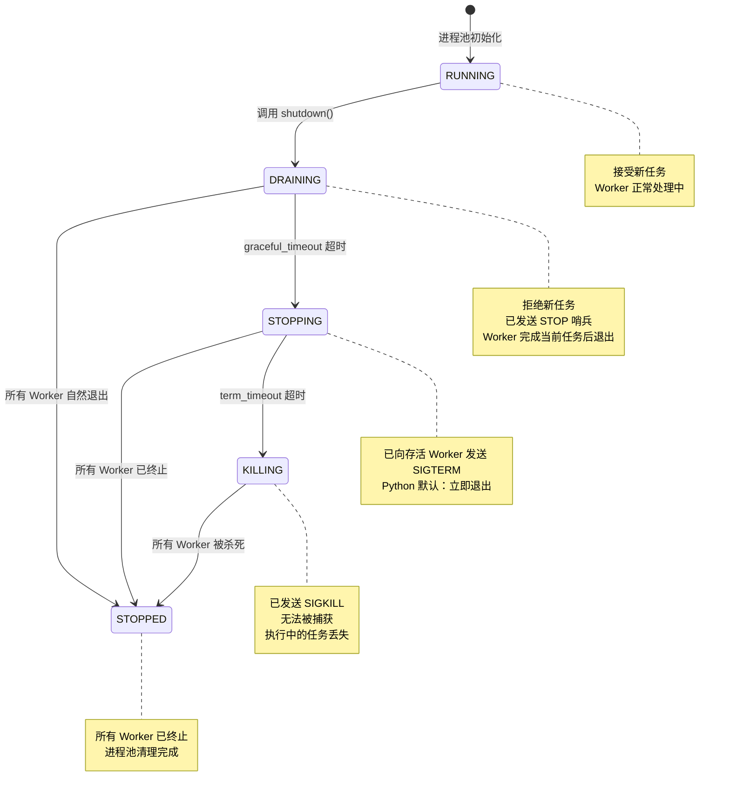

# Worker Pool 模块

`WorkerPool` 模块提供了一个简单、轻量级的驻留 Worker 进程池，用于并行任务执行。它采用 `spawn` 模式多进程，确保跨平台一致性。

## 目录

*   [生命周期钩子](lifecycle_hooks.md): Worker 级和任务级钩子函数的使用。
*   [管理与统计](management_statistics.md): 运行时状态查询、统计信息收集、健康检查。
*   [API 参考](api_reference.md): 完整的类、枚举、数据类和异常定义。
*   [任务编写指南](task_guide.md): 任务函数规则、模板和错误处理。
*   [最佳实践与陷阱](best_practices.md): 最佳实践和常见陷阱及解决方案。

---

## 1. 概述

### 什么是 WorkerPool？

`WorkerPool` 是一个驻留型 Worker 进程池，管理固定数量的 Worker 进程。与 `multiprocessing.Pool` 不同，`WorkerPool` 中的 Worker 在完成任务后保持存活，通过队列等待新任务。

### 核心特性

| 特性 | 描述 |
|------|------|
| **Spawn 模式** | 使用 `spawn` 上下文，跨平台一致 |
| **驻留 Worker** | Worker 持久存在，避免重复启动进程的开销 |
| **崩溃恢复** | Worker 崩溃后自动重启 |
| **任务追溯** | 即使 Worker 崩溃，失败任务也能被追踪 |
| **Future 模式** | 支持超时的异步结果处理 |
| **优雅停机** | 三段式停机：DRAINING → STOPPING → KILLING → STOPPED |
| **生命周期钩子** | 支持 Worker 级和任务级的钩子函数 |
| **资源监控** | 任务执行耗时、内存增量等资源统计 |
| **管理统计** | 运行时状态查询、统计信息收集、健康检查 |

### 进程池状态机

停机过程中的状态转换：



### 适用场景

- **批量处理**：并行处理大量独立项目
- **CPU 密集型工作**：跨进程分发 CPU 密集操作
- **I/O 密集型工作**：并行数据库查询或 API 调用
- **外部队列消费者**：作为 Celery、RQ 等任务队列的 Worker 进程池
- **已存在的单线程模块并行执行**：当现有模块设计为单线程、内部共享 ActiveRecord 后端实例时，使用 WorkerPool 可以避免并行执行时的连接状态污染

---

## 2. WorkerPool vs 连接池：如何选择？

在涉及数据库操作的并发场景中，WorkerPool 和连接池（`BackendPool`）是两种不同的解决方案，各有适用场景：

| 场景 | WorkerPool | 连接池 |
|------|------------|--------|
| **连接隔离需求** | ✓ 每个 Worker 进程独立连接 | ✗ 连接复用，不隔离 |
| **复杂长时间任务** | ✓ 进程隔离，崩溃不影响其他 | ✗ 长事务可能超时 |
| **崩溃隔离** | ✓ Worker 崩溃自动重启 | ✗ 影响共享连接 |
| **简单并发查询** | ✗ 进程创建开销大 | ✓ 轻量高效 |
| **共享事务上下文** | ✗ 进程间无法共享 | ✓ 上下文感知 |
| **上下文感知** | ✗ 无 | ✓ ActiveRecord 集成 |

### 进程级别的开销与限制

**重要提醒**：WorkerPool 是**进程级别**的并发解决方案，相比连接池（线程/协程级别）有显著的开销：

#### 管理开销

| 开销类型 | WorkerPool（进程） | 连接池（线程/协程） |
|----------|-------------------|-------------------|
| **创建开销** | 高（进程复制、内存分配） | 低（连接对象创建） |
| **内存占用** | 高（每个进程独立内存空间） | 低（共享内存空间） |
| **通信开销** | 高（IPC 序列化/反序列化） | 低（直接内存访问） |
| **上下文切换** | 高（进程切换） | 低（线程/协程切换） |
| **启动延迟** | 毫秒级 | 微秒级 |

#### 具体开销示例

```python
# WorkerPool：进程级别开销
# - 每个 Worker 进程独立内存空间（通常 10-50MB/进程）
# - 任务参数需要 pickle 序列化传递
# - 返回结果需要 pickle 反序列化接收
# - 进程间通信（IPC）开销

# 连接池：线程/协程级别开销
# - 共享内存空间，无需序列化
# - 连接对象轻量（通常 < 1MB/连接）
# - 直接内存访问，无 IPC 开销
```

### 不推荐使用 WorkerPool 的场景

| 场景 | 推荐替代方案 |
|------|------------------------|
| **频繁的小任务** | 连接池 + 线程/协程 |
| **低延迟要求** | 连接池 |
| **内存受限环境** | 连接池 |
| **需要共享大量数据** | 线程 + 连接池 |
| **简单并发查询** | 连接池 |
| **需要共享事务** | 连接池的 `transaction()` |
| **单机高并发 Web** | 异步 + 连接池 |

#### 开销对比示例

```python
import time
from rhosocial.activerecord.connection.pool import BackendPool, PoolConfig
from rhosocial.activerecord.worker import WorkerPool

# 场景：执行 1000 个简单查询

# WorkerPool 方式（不推荐）
def worker_query(user_id):
    # 每次调用都有 IPC 开销
    return User.find_one(id=user_id)

worker_pool = WorkerPool(num_workers=4)
start = time.time()
futures = [worker_pool.submit(worker_query, i) for i in range(1000)]
results = [f.result() for f in futures]
print(f"WorkerPool: {time.time() - start:.2f}s")  # 可能需要 5-10 秒

# 连接池方式（推荐）
pool = BackendPool(PoolConfig(min_size=4, max_size=10, ...))
start = time.time()
with pool.connection():
    results = [User.find_one(id=i) for i in range(1000)]
print(f"Connection Pool: {time.time() - start:.2f}s")  # 可能只需 0.5-1 秒
```

### 推荐使用 WorkerPool 的场景

1. **需要严格区分连接实例**：每个 Worker 进程拥有独立的数据库连接，避免连接状态污染
2. **复杂的数据库任务**：长时间运行的任务，需要进程级别的隔离
3. **任务崩溃不影响其他任务**：Worker 崩溃后自动重启，失败任务可追溯
4. **CPU 密集型 + 数据库操作**：真正并行执行，绕过 GIL 限制

#### 推荐使用连接池的场景

1. **简单的并发查询**：轻量级连接复用，无需进程开销
2. **需要共享事务上下文**：`pool.transaction()` 提供事务上下文感知
3. **ActiveRecord 集成**：模型自动感知连接池上下文
4. **Web 应用请求处理**：每个请求获取独立连接，请求结束后归还

#### 混合使用示例

```python
from rhosocial.activerecord.connection.pool import BackendPool, PoolConfig
from rhosocial.activerecord.worker import WorkerPool

# 连接池：用于 Web 请求处理
web_pool = BackendPool(PoolConfig(
    min_size=5,
    max_size=20,
    backend_factory=lambda: SQLiteBackend(database="app.db")
))

# WorkerPool：用于后台批量任务
worker_pool = WorkerPool(num_workers=4)

def process_batch_task(item_ids: list):
    """每个 Worker 进程有独立的数据库连接"""
    # Worker 进程内部可以使用连接池
    with web_pool.connection() as conn:
        for item_id in item_ids:
            # 处理任务...
            pass

# 提交批量任务
worker_pool.submit(process_batch_task, item_ids=[1, 2, 3, 4, 5])
```

### 不适用场景

WorkerPool **不是**完整的任务队列系统，以下功能需要使用专业库（如 Celery、RQ、Dramatiq）：

| 功能 | WorkerPool | 专业任务队列 |
| --- | ---------- | ------------ |
| 任务优先级 | ❌ FIFO only | ✅ 支持 |
| 任务持久化 | ❌ 内存队列 | ✅ Redis/DB |
| 延迟任务 | ❌ 不支持 | ✅ 支持 |
| 自动重试 | ❌ 不支持 | ✅ 支持 |
| 任务去重 | ❌ 不支持 | ✅ 支持 |
| 任务依赖 | ❌ 不支持 | ✅ 支持 |
| 分布式 | ❌ 单进程 | ✅ 多节点 |

如果你需要上述功能，可以将 WorkerPool 作为外部任务队列的消费者，或者直接使用专业任务队列库。

---

## 3. 为什么需要 WorkerPool

### 问题背景

在使用 ActiveRecord 进行并行数据库操作时，存在两种常见的连接管理模式：

| 模式 | 描述 | 问题 |
|------|------|------|
| **共享连接** | 所有并发任务共享一个数据库连接 | 连接状态污染、请求交织、数据竞争 |
| **独立连接** | 每个并发任务拥有独立的数据库连接 | 需要进程隔离来保证连接独立性 |

### 共享连接模式的问题

当使用 `asyncio` 协程并发执行数据库操作时，如果所有协程共享同一个连接，会出现严重的问题：

```python
# 错误示例：共享连接导致的问题
async def shared_connection_test():
    config = MySQLConnectionConfig(...)
    await User.configure(config, AsyncMySQLBackend)

    # 所有协程共享同一个连接
    async def worker_task(user_id: int):
        # 问题1：多个协程可能同时执行查询
        # 问题2：事务状态可能被其他协程干扰
        # 问题3：连接状态不可预测
        user = await User.find_one(id=user_id)
        user.balance += 100
        await user.save()

    # 启动100个并发协程
    tasks = [worker_task(i) for i in range(100)]
    await asyncio.gather(*tasks)  # 高失败率！
```

#### 具体问题表现

**1. 请求交织（Request Interleaving）**

多个协程的 SQL 语句可能在网络层交织，导致服务器收到无效数据：

```
协程 A 发送: SELECT * FROM users WHERE id = 1
协程 B 发送: UPDATE users SET balance = 100 WHERE id = 2

服务器实际收到（交织）: SELECT * FROM users WHERE id = 1UPDATE users SET balance = 100 WHERE id = 2
结果: SQL 语法错误，查询失败
```

**2. 结果错配（Result Mismatch）**

协程 A 发起的查询，结果可能被协程 B 接收。

**3. 事务状态污染（Transaction Pollution）**

一个协程的事务操作会影响其他协程。

**实测数据**：

| 测试场景 | 并发数 | 总操作数 | 成功率 | 主要错误 |
|----------|--------|----------|--------|----------|
| MySQL 共享连接 | 5 | 50 | **27%** | 连接状态污染、请求交织 |
| MySQL WorkerPool | 5 | 50 | **100%** | 无 |
| PostgreSQL 共享连接 | 5 | 50 | **31%** | 连接状态污染 |
| PostgreSQL WorkerPool | 5 | 50 | **100%** | 无 |

### WorkerPool 如何解决问题

WorkerPool 使用 `multiprocessing` 实现真正的进程隔离：

1. **独立进程空间**：每个 Worker 进程有独立的内存空间
2. **独立数据库连接**：每个 Worker 创建和管理自己的连接
3. **状态隔离**：一个 Worker 的连接状态不会影响其他 Worker
4. **崩溃隔离**：一个 Worker 崩溃不会影响其他 Worker

---

## 4. 设计原则

### WorkerPool 只管基础设施

核心设计理念：**WorkerPool 管理任务分发、结果收集和崩溃恢复 —— 其他一概不管。**

| WorkerPool 职责 | 用户职责 |
|----------------|---------|
| 进程生命周期管理 | 定义任务函数 |
| 任务队列管理 | 导入所需的 ORM 模型 |
| 结果收集 | 配置数据库连接 |
| Worker 健康监控 | 处理事务 |
| 崩溃恢复 | 管理连接生命周期 |

### 为什么这样设计？

最小化设计理念是有意为之的。尝试抽象更多功能的替代方案面临根本性挑战：

1. **Handler 注册无法跨进程**：全局状态在 `spawn` 后不存活，基于回调的模式不可靠
2. **动态导入不可靠**：模块路径往往无法在 Worker 进程中一致地解析
3. **模型序列化复杂**：ActiveRecord 实例包含数据库连接，无法直接 pickle

通过保持 `WorkerPool` 最小化，用户对其数据操作拥有完全的控制权和透明度。

---

## 5. 快速开始

> **可运行示例** 位于 [`docs/examples/chapter_07_worker_pool/`](../../examples/chapter_07_worker_pool/)。

### 基本用法

```python
from rhosocial.activerecord.worker import WorkerPool, TaskContext

# 任务函数必须接受 ctx 作为第一个参数
def double(ctx: TaskContext, n: int) -> int:
    return n * 2

# 使用 WorkerPool
if __name__ == '__main__':
    with WorkerPool(n_workers=4) as pool:
        # 提交单个任务（ctx 自动注入）
        future = pool.submit(double, 5)
        result = future.result(timeout=10)
        print(result)  # 输出: 10

        # 提交多个任务
        futures = [pool.submit(double, i) for i in range(10)]
        results = [f.result(timeout=10) for f in futures]
        print(results)  # 输出: [0, 2, 4, 6, 8, 10, 12, 14, 16, 18]
```

### 涉及数据库操作

```python
# task_functions.py - 独立模块存放任务定义
from typing import Optional
from rhosocial.activerecord.worker import TaskContext

def submit_comment_task(ctx: TaskContext, params: dict) -> int:
    """
    提交评论任务。

    Args:
        ctx: 任务上下文（自动注入）
        params: 包含以下键的字典：
            - db_path: 数据库路径
            - post_id: 文章 ID
            - user_id: 用户 ID
            - content: 评论内容

    Returns:
        int: 新创建评论的 ID
    """
    db_path = params['db_path']
    post_id = params['post_id']
    user_id = params['user_id']
    content = params['content']

    # 1. 在 Worker 进程内配置数据库连接
    from rhosocial.activerecord.backend.impl.sqlite import SQLiteBackend
    from rhosocial.activerecord.backend.impl.sqlite.config import SQLiteConnectionConfig
    from myapp.models import User, Post, Comment

    config = SQLiteConnectionConfig(database=db_path)
    User.configure(config, SQLiteBackend)
    Post.__backend__ = User.backend()
    Comment.__backend__ = User.backend()

    comment_id: Optional[int] = None

    try:
        # 2. 在事务中执行业务逻辑
        with Post.transaction():
            post = Post.find_one(post_id)
            if post is None:
                raise ValueError(f"文章 {post_id} 不存在")

            user = User.find_one(user_id)
            if user is None:
                raise ValueError(f"用户 {user_id} 不存在")
            if not user.is_active:
                raise ValueError(f"用户 {user_id} 未激活")

            if post.status != 'published':
                raise ValueError(f"文章 {post_id} 未发布")

            comment = Comment(
                post_id=post.id,
                user_id=user_id,
                content=content
            )
            comment.save()
            comment_id = comment.id

        # 3. 返回结果
        return comment_id

    finally:
        # 4. 清理连接
        User.backend().disconnect()
```

```python
# main.py - 主程序
from rhosocial.activerecord.worker import WorkerPool
from task_functions import submit_comment_task

if __name__ == '__main__':
    with WorkerPool(n_workers=4) as pool:
        # 提交评论任务
        future = pool.submit(submit_comment_task, {
            'db_path': '/path/to/app.db',
            'post_id': 123,
            'user_id': 456,
            'content': '好文章！'
        })

        try:
            comment_id = future.result(timeout=30)
            print(f"评论已创建，ID: {comment_id}")
        except Exception as e:
            print(f"创建评论失败: {e}")
            if future.traceback:
                print(f"堆栈追踪:\n{future.traceback}")
```

---

## 示例代码

本章的完整示例代码位于 `docs/examples/chapter_07_worker_pool/` 目录。

| 文件 | 说明 |
|------|------|
| [basic_usage.py](../../examples/chapter_07_worker_pool/basic_usage.py) | 基本用法：创建进程池、提交任务、获取结果 |
| [async_mode.py](../../examples/chapter_07_worker_pool/async_mode.py) | 异步模式：使用异步 API 进行任务管理 |
| [connection_management.py](../../examples/chapter_07_worker_pool/connection_management.py) | 连接管理：在 Worker 中管理数据库连接 |
| [hooks_usage.py](../../examples/chapter_07_worker_pool/hooks_usage.py) | 钩子使用：生命周期钩子完整示例 |
